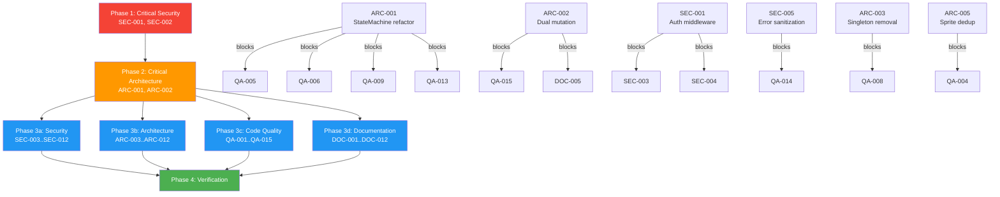

# Project Audit Report

> **Project**: Claude Office Visualizer
> **Date**: 2026-04-28
> **Stack**: Python (FastAPI, Pydantic, SQLAlchemy), TypeScript (React, Next.js, PixiJS, Zustand, XState)
> **Audited by**: Claude Code Audit System

---

## Executive Summary

Claude Office Visualizer is an architecturally ambitious project with strong foundational patterns (type-safe frontend-backend contract, XState agent machines, clean handler decomposition) but suffers from two critical structural problems: a **dual state mutation pattern** where `StateMachine.transition()` and `EventProcessor._process_event_internal()` both mutate the same state, and a **complete absence of authentication** on all API endpoints including ones that spawn subprocesses and write to the system clipboard. The codebase has good backend test coverage (~70%) but zero meaningful frontend tests. Estimated effort to resolve top issues: 2-3 focused sprints. One genuine strength: the Pydantic-to-TypeScript type generation pipeline and XState agent lifecycle modeling are production-quality patterns.

### Issue Count by Severity

| Severity | Architecture | Security | Code Quality | Documentation | Total |
|----------|:-----------:|:--------:|:------------:|:-------------:|:-----:|
| Critical | 2 | 2 | 2 | 1 | **7** |
| High     | 4 | 4 | 6 | 5 | **19** |
| Medium   | 6 | 6 | 7 | 6 | **25** |
| Low      | 7 | 5 | 4 | 5 | **21** |
| **Total**| **19** | **17** | **19** | **17** | **72** |

---

## Critical Issues (Resolve Immediately)

### [SEC-001] No Authentication or Authorization on Any API Endpoint
- **Area**: Security
- **CWE/OWASP**: CWE-306 / OWASP A01
- **Location**: `backend/app/api/routes/sessions.py`, `backend/app/api/routes/events.py`, `backend/app/api/routes/preferences.py`, `backend/app/api/websocket.py`
- **Description**: None of the REST or WebSocket endpoints require any form of authentication. Any network-reachable client can POST events, DELETE all sessions, trigger subprocess execution, write to the clipboard, or modify preferences.
- **Impact**: Complete application takeover from any network-reachable host. Subprocess execution via `/sessions/simulate` and clipboard overwrite via `/sessions/{id}/focus` are the highest-risk endpoints.
- **Remedy**: Add localhost-only middleware at minimum; add API key or token-based auth between hooks and backend.

### [SEC-002] CORS Allows All Origins with Wildcard
- **Area**: Security
- **CWE/OWASP**: CWE-942 / OWASP A05
- **Location**: `backend/app/main.py:87`
- **Description**: `allow_origins=["*"]` overrides the configured `BACKEND_CORS_ORIGINS` list. Any website can make cross-origin requests.
- **Impact**: CSRF attacks from any webpage: delete sessions, inject events, execute subprocesses, overwrite clipboard.
- **Remedy**: Use `settings.BACKEND_CORS_ORIGINS` instead of wildcard.

### [ARC-001] StateMachine God Object (848 lines, 43 methods)
- **Area**: Architecture
- **Location**: `backend/app/core/state_machine.py`
- **Description**: Single dataclass holding 25+ mutable fields with 43 methods mixing domain logic, JSONL file I/O, agent creation, and todo parsing. The `transition()` method is a 230-line if/elif chain.
- **Impact**: Any modification to event handling, agent management, or whiteboard tracking requires touching this single class. Hidden blocking I/O in what should be a pure state container.
- **Remedy**: Extract `TokenTracker`, `AgentFactory`, `TodoParser` as focused modules. Replace if/elif chain with dispatch table.

### [ARC-002] Dual State Mutation: EventProcessor AND StateMachine
- **Area**: Architecture
- **Location**: `backend/app/core/event_processor.py:291-482`, `backend/app/core/state_machine.py:517-848`
- **Description**: State mutated in three places per event: `StateMachine.transition()`, `EventProcessor._process_event_internal()`, and handler functions. Handlers set `sm.boss_state` and `sm.agents[agent_id].state` directly.
- **Impact**: Nearly impossible to determine final state after any event without tracing execution through three locations. Handlers and transition method can conflict.
- **Remedy**: Adopt single-responsibility model: handlers return transition instructions rather than mutating state directly, or remove `StateMachine.transition()` and let `EventProcessor` be sole coordinator.

### [QA-001] gameStore.ts God Object (1204 lines)
- **Area**: Code Quality
- **Location**: `frontend/src/stores/gameStore.ts`
- **Description**: Zustand store managing 90+ actions, 30+ state slices, agents, bosses, queues, bubbles, whiteboard, UI, debug, replay, and office state. Contains 20 instances of `new Map(state.agents)` copying the entire agents Map on every update.
- **Impact**: Significant allocation pressure during active animation. Any change requires understanding all 30+ fields. Untestable as a unit.
- **Remedy**: Split into domain-specific slices (agentsSlice, bossSlice, bubbleSlice, officeSlice, uiSlice) using Zustand slice pattern. Use immer middleware to reduce Map-copy boilerplate.

### [QA-002] N+1 Query in Session Listing
- **Area**: Code Quality
- **Location**: `backend/app/api/routes/sessions.py:124-131`
- **Description**: `list_sessions` executes a separate `SELECT COUNT(*)` per session. 50 sessions = 51 queries.
- **Impact**: O(N) database queries on every session list fetch. Linear degradation.
- **Remedy**: Use single `GROUP BY` query with `func.count()`.

### [DOC-001] Multi-Floor/Agent Teams Features Undocumented
- **Area**: Documentation
- **Location**: `docs/ARCHITECTURE.md`, `backend/README.md`
- **Description**: Fully implemented modules (`floor_config.py`, `room_orchestrator.py`, `team_handler.py`, `/api/v1/floors`, `/ws/room/{room_id}`) have zero documentation in ARCHITECTURE.md or backend README.
- **Impact**: New developers and contributors have no way to understand these subsystems.
- **Remedy**: Add "Multi-Floor / Agent Teams" section to ARCHITECTURE.md. Update component tables and project structure.

---

## High Priority Issues

### [SEC-003] WebSocket Accepts Connections Without Origin or Session Validation
- **Area**: Security | **Location**: `backend/app/api/websocket.py:19-25`
- **Description**: No origin validation, no auth token, no session ID format validation. Any client connects to any session.
- **Remedy**: Validate Origin header, restrict to localhost, add handshake token.

### [SEC-004] Unrestricted Clipboard Write via `/focus` Endpoint
- **Area**: Security | **Location**: `backend/app/api/routes/sessions.py:288-294`
- **Description**: Pipes arbitrary text into `pbcopy` via subprocess.run with no length limit or sanitization.
- **Remedy**: Add auth, restrict to localhost, impose max message length.

### [SEC-005] Error Details Leak Internal Exception Information
- **Area**: Security | **Location**: All `backend/app/api/routes/*.py`
- **Description**: Every exception handler passes `str(e)` directly into HTTPException detail, exposing DB errors, file paths, and module names.
- **Remedy**: Return generic error messages to clients; log detailed exceptions server-side.

### [SEC-006] XML External Entity (XXE) in Hook Event Parsing
- **Area**: Security | **Location**: `hooks/src/claude_office_hooks/event_mapper.py:12,248`
- **Description**: Uses `xml.etree.ElementTree` to parse attacker-influenced XML content from prompts.
- **Remedy**: Use `defusedxml.ElementTree` as drop-in replacement.

### [ARC-003] Module-Level Singletons Prevent Testability
- **Area**: Architecture | **Location**: `event_processor.py`, `websocket.py`, `summary_service.py`, `product_mapper.py`, `database.py`
- **Description**: Every major service is a module-level global. No dependency injection. Tests must manipulate global state.
- **Remedy**: Introduce FastAPI `Depends()` or factory functions.

### [ARC-004] Duplicate Dependencies Between Root and Backend pyproject.toml
- **Area**: Architecture | **Location**: `pyproject.toml:50-56`, `backend/pyproject.toml:7-22`
- **Description**: Same packages declared in both locations with potentially different versions. Root uses `requests`, backend uses `httpx`.
- **Remedy**: Make root reference backend as path dependency, or move simulation scripts into backend.

### [ARC-005] Duplicated Sprite-Debug Component Tree (~3000 lines)
- **Area**: Architecture | **Location**: `frontend/src/app/sprite-debug/` vs `frontend/src/components/debug/sprite-debug/`
- **Description**: Six files are byte-for-byte identical across two directories.
- **Remedy**: Keep `components/` as source of truth; have `app/sprite-debug/page.tsx` import from it.

### [ARC-006] Schema Migration via Manual ALTER TABLE
- **Area**: Architecture | **Location**: `backend/app/main.py:33-59`
- **Description**: Hand-rolled migration despite `alembic` being a dependency. No alembic/ directory exists.
- **Remedy**: Fully adopt Alembic or remove the dependency and document the SQLite-only approach.

### [QA-003] Console.log Left in Production Code (12 locations)
- **Area**: Code Quality | **Location**: `gameStore.ts`, `useWebSocketEvents.ts`, `animationSystem.ts`, `compactionAnimation.ts`, `agentMachineService.ts`
- **Description**: Debug console.log() in bubble queuing, WebSocket events, and animation frames.
- **Remedy**: Remove all debug console.log statements; use flag-gated debug logger if needed.

### [QA-004] Duplicate Sprite-Debug Directory (6 files, ~3000 lines)
- **Area**: Code Quality | **Location**: Same as ARC-005
- **Description**: Byte-for-byte identical files must be maintained in two places.
- **Remedy**: Same as ARC-005.

### [QA-005] Silently Swallowed Exceptions in State Machine
- **Area**: Code Quality | **Location**: `backend/app/core/state_machine.py:408,428,482`
- **Description**: Three methods catch `Exception` with bare `pass` and no logging. Token counts silently become stale.
- **Remedy**: Add `logger.debug()` calls; wrap `transition()` in try/except with rollback.

### [QA-006] transition() Method Excessive Cyclomatic Complexity
- **Area**: Code Quality | **Location**: `backend/app/core/state_machine.py:517-741`
- **Description**: 224-line cascade of 53 if/elif branches mixing state mutation, JSONL parsing, bubble generation, and agent lifecycle.
- **Remedy**: Create `dict[EventType, Callable]` dispatch table.

### [QA-007] WebSocket Manager Duplication (broadcast vs broadcast_room)
- **Area**: Code Quality | **Location**: `backend/app/api/websocket.py:36-60,120-144`
- **Description**: Nearly identical methods for session vs room broadcasting.
- **Remedy**: Extract generic `_broadcast_to_connections()` helper.

### [QA-008] Module-Level Global Mutable Singletons (10 locations)
- **Area**: Code Quality | **Location**: 10 service files across backend
- **Description**: Same as ARC-003 but from testability perspective.
- **Remedy**: Same as ARC-003.

### [DOC-002] Missing API Endpoint Documentation
- **Area**: Documentation | **Location**: `backend/README.md`
- **Description**: PATCH sessions, GET floors, DELETE sessions, POST focus, and `/ws/room/{room_id}` endpoints not listed.
- **Remedy**: Add all missing endpoints to the API Endpoints table.

### [DOC-003] No CONTRIBUTING.md File
- **Area**: Documentation | **Location**: Missing from project root
- **Description**: README mentions contributing but no guidance on code style, PR process, testing requirements.
- **Remedy**: Create CONTRIBUTING.md with development setup, conventions, PR process.

### [DOC-004] OpenCode Plugin Has No README
- **Area**: Documentation | **Location**: `opencode-plugin/`
- **Description**: No README.md in the plugin directory.
- **Remedy**: Create opencode-plugin/README.md.

### [DOC-005] Zero Function-Level Docstring Coverage on Backend Public Methods
- **Area**: Documentation | **Location**: All `backend/app/` files
- **Description**: ~250+ public functions lack docstrings. Critical methods like `StateMachine.transition()` and `EventProcessor.process_event()` have no parameter/return documentation.
- **Remedy**: Add Google-style docstrings to all public methods, prioritizing state machine and event processor.

### [DOC-006] No Environment Variable Reference in Architecture Doc
- **Area**: Documentation | **Location**: `docs/ARCHITECTURE.md`
- **Description**: Configuration options like `GIT_POLL_INTERVAL`, `SUMMARY_MODEL`, `CLAUDE_PATH_HOST` not documented in architecture doc.
- **Remedy**: Add "Configuration Reference" section or cross-references to backend README.

---

## Medium Priority Issues

### Architecture
- **[ARC-007]** Event Type Enumeration Duplicated Across Three Packages — `backend/app/models/events.py`, `hooks/event_mapper.py`, `opencode-plugin/src/index.ts`
- **[ARC-008]** gameStore.ts is a 1200-Line Monolith (same as QA-001) — Zustand store holds 30+ fields in one flat structure
- **[ARC-009]** WebSocket URL Hardcoded — `ws://localhost:8000` with no env var override
- **[ARC-010]** Session Route Contains OS-Specific Subprocess Calls — `osascript`/`pbcopy` (macOS-only)
- **[ARC-011]** Console.log Statements in Production Code (same as QA-003)
- **[ARC-012]** CORS Middleware Uses Wildcard Despite Specific Origins Config (same as SEC-002)

### Security
- **[SEC-007]** Hardcoded User-Specific Paths in Distributed Code — developer's username in `hooks/config.py` defaults
- **[SEC-008]** No Rate Limiting on Event Ingestion or API Endpoints
- **[SEC-009]** No Input Validation on WebSocket Path Parameters
- **[SEC-010]** OAuth Token Logged in Plaintext to Debug File
- **[SEC-011]** Path Traversal Risk in Static File Serving — no explicit boundary check
- **[SEC-012]** Static File Serving Enabled by Directory Existence — implicit, not configured

### Code Quality
- **[QA-009]** Excessive Property Proxy Boilerplate in StateMachine — 100 lines of getter/setter pairs for whiteboard delegation
- **[QA-010]** Hardcoded WebSocket URL in Frontend — no env var override
- **[QA-011]** Synchronous Blocking Subprocess Calls in Request Handlers — `subprocess.run()` blocks async event loop
- **[QA-012]** Magic Numbers in JSONL Parsing — `20000` and `50000` byte read sizes unexplained
- **[QA-013]** State Machine transition() Lacks Atomicity — partial state on mid-transition exception
- **[QA-014]** Broad Exception Handling in API Routes — `catch Exception` everywhere loses specificity
- **[QA-015]** Workspace Broadcast on Every Poller Update — full serialization on every event

### Documentation
- **[DOC-007]** Backend `config.py` VERSION Field Is Stale — shows `0.1.0` instead of `0.14.0`
- **[DOC-008]** docs/ Directory Does Not Follow Recommended Layout from Style Guide
- **[DOC-009]** QUICKSTART.md Uses Emojis in Callout Notes (violates style guide)
- **[DOC-010]** README.md "What's New" Section Duplicates CHANGELOG Content
- **[DOC-011]** Frontend README Missing Stores Added After v0.12.0
- **[DOC-012]** No `.github/ISSUE_TEMPLATE` or PR Template

---

## Low Priority / Improvements

### Architecture
- **[ARC-013]** Verbose Generated Types File — consider cleaner code generator
- No frontend test coverage despite vitest being configured
- Event processing via background tasks without error feedback to caller
- `random` module in SummaryService makes testing non-deterministic
- `alembic` and `asyncpg` as unused dependencies

### Security
- **[SEC-013]** OpenAPI Schema Exposed in Production
- **[SEC-014]** No Security Headers on HTTP Responses
- **[SEC-015]** SQLite Database File in Source Directory
- **[SEC-016]** XML Parsing Uses Standard Library Instead of defusedxml
- **[SEC-017]** `random` Module Used for Non-Security Purposes (informational)

### Code Quality
- **[QA-016]** `useEffect` + `useState` in Dynamic-Imported Component — cosmetic only
- **[QA-017]** `eslint-disable` for Auto-Generated File — standard practice
- **[QA-018]** `noqa: E402` Comments in Hooks — justified
- **[QA-019]** `pyright: ignore[reportUnusedImport]` in Test Fixtures — appropriate

### Documentation
- **[DOC-013]** Frontend Has Near-Zero JSDoc Coverage (7 blocks total)
- **[DOC-014]** `docs/research/` and `docs/superpowers/` Are Undocumented
- **[DOC-015]** `todos.md` and `AGENTS.md` Are Empty or Near-Empty
- **[DOC-016]** `GEMINI_UPDATE.md` (53 KB) and `PRD.md` (52 KB) Not Standard Documentation
- **[DOC-017]** CHANGELOG Uses ISO Date Format but README Uses Month-Only

---

## Detailed Findings

### Architecture & Design

**Overall Health: Fair** | Files Reviewed: 40+ | Confidence: High

The project has a clean handler decomposition in `app/core/handlers/` with focused single-responsibility files and a type-safe frontend-backend contract via `scripts/gen_types.py`. The XState agent state machines in the frontend provide explicit, visualizable transitions. However, the dual state mutation pattern between `StateMachine.transition()` and `EventProcessor._process_event_internal()` is the most architecturally significant issue. Module-level singletons across all services prevent testability and dependency injection. The sprite-debug component tree is fully duplicated in two directories (~3000 lines). Schema migrations use hand-rolled ALTER TABLE statements despite `alembic` being listed as a dependency.

### Security Assessment

**Overall Posture: Poor** | Files Reviewed: 25+ | Confidence: High

The complete absence of authentication on all API endpoints is the highest-risk finding. Combined with CORS wildcard origins, any network-reachable attacker can execute subprocess commands, overwrite the system clipboard, inject events, and delete all data. The hooks use standard library XML parsing on attacker-influenced content (XXE risk). Error handlers leak internal exception details including database schema and file paths. Positive: Pydantic validation on event inputs, SQLAlchemy ORM preventing SQL injection, subprocess calls using list-form arguments, no dangerouslySetInnerHTML, and Docker mounts read-only.

### Code Quality

**Overall Health: Fair** | Files Reviewed: 35+ | Confidence: High

The `gameStore.ts` god object at 1204 lines is the single biggest maintainability risk, combining all domain state, UI state, and animation coordination. The `StateMachine.transition()` method at 224 lines with 53 if/elif branches is the backend equivalent. Both are high-priority decomposition targets. Backend test coverage is good (~70%, 264 test functions) but frontend has zero meaningful tests (2 files: a smoke test and an i18n parity test). 12 console.log statements fire in production during every animation frame and WebSocket event. The N+1 query in session listing will degrade linearly as sessions accumulate.

### Documentation Review

**Overall Health: Good** | Files Reviewed: 20+ | Confidence: High

The CHANGELOG is excellent (Keep a Changelog format, detailed entries). ARCHITECTURE.md at 630+ lines is comprehensive with Mermaid diagrams. QUICKSTART.md genuinely gets a developer from clone to running in under 5 minutes. The critical gap: multi-floor/Agent Teams features are fully implemented in code but have zero documentation. Function-level docstring coverage on the backend is near zero (~250+ public functions undocumented). No CONTRIBUTING.md, no OpenCode plugin README, and the frontend README is stale (missing 3 stores and the i18n directory).

---

## Remediation Roadmap

### Immediate Actions (Before Next Deployment)
1. Add localhost-only middleware to backend (SEC-001)
2. Replace CORS wildcard with configured origins (SEC-002)
3. Fix N+1 query in session listing (QA-002)
4. Remove console.log statements from production frontend code (QA-003)

### Short-term (Next 1-2 Sprints)
1. Refactor StateMachine: extract TokenTracker, AgentFactory, dispatch table (ARC-001, ARC-002, QA-006)
2. Resolve dual state mutation pattern (ARC-002)
3. Split gameStore.ts into domain slices (QA-001)
4. Deduplicate sprite-debug components (ARC-005, QA-004)
5. Add error message sanitization in API routes (SEC-005)
6. Replace xml.etree with defusedxml in hooks (SEC-006)
7. Document multi-floor/Agent Teams in ARCHITECTURE.md (DOC-001)

### Long-term (Backlog)
1. Introduce dependency injection for backend services (ARC-003, QA-008)
2. Add frontend test coverage for gameStore and WebSocket hook
3. Consolidate root and backend pyproject.toml (ARC-004)
4. Adopt Alembic or remove unused dependency (ARC-006)
5. Create CONTRIBUTING.md and community templates (DOC-003, DOC-012)
6. Add function-level docstrings to backend public methods (DOC-005)
7. Make WebSocket/API URLs configurable via environment variables (ARC-009)

---

## Positive Highlights

1. **Type-Safe Frontend-Backend Contract**: `scripts/gen_types.py` generates TypeScript from Pydantic models — single source of truth for the data contract.
2. **XState Agent State Machines**: Frontend agent lifecycle modeled with XState v5 with arrival/departure sub-machines, proper guards and actions.
3. **Clean Handler Decomposition**: `app/core/handlers/` has focused single-responsibility files with clear docstrings and dependency injection via callables.
4. **Docker Production Build**: Multi-stage Dockerfile separates frontend build from Python runtime, creates non-root user, includes health checks.
5. **Outstanding Changelog**: Follows "Keep a Changelog" format with detailed, categorized entries for every release.
6. **Pydantic Validation on All Event Inputs**: Strong input validation for the main event ingestion endpoint.
7. **Robust WebSocket Reconnection**: Sophisticated strategy with connection ID tracking, minimum typing duration, and proper cleanup on session switch.
8. **Backend Test Coverage ~70%**: 264 test functions across 16 files covering state machine, API endpoints, pollers, persistence, and team detection.

---

## Audit Confidence

| Area | Files Reviewed | Confidence |
|------|---------------|-----------|
| Architecture | 40+ | High |
| Security | 25+ | High |
| Code Quality | 35+ | High |
| Documentation | 20+ | High |

---

## Remediation Plan

> This section is generated by the audit and consumed directly by `/fix-audit`.
> It pre-computes phase assignments and file conflicts so the fix orchestrator
> can proceed without re-analyzing the codebase.

### Phase Assignments

#### Phase 1 — Critical Security (Sequential, Blocking)
<!-- Issues that must be fixed before anything else. -->
| ID | Title | File(s) | Severity |
|----|-------|---------|----------|
| SEC-001 | No authentication on any API endpoint | `backend/app/main.py`, `backend/app/api/routes/*.py` | Critical |
| SEC-002 | CORS allows all origins with wildcard | `backend/app/main.py` | Critical |

#### Phase 2 — Critical Architecture (Sequential, Blocking)
<!-- Issues that restructure the codebase; must complete before Code Quality fixes. -->
| ID | Title | File(s) | Severity | Blocks |
|----|-------|---------|----------|--------|
| ARC-001 | StateMachine God Object | `backend/app/core/state_machine.py` | Critical | QA-005, QA-006, QA-009, QA-013, DOC-005 |
| ARC-002 | Dual State Mutation (EventProcessor + StateMachine) | `backend/app/core/state_machine.py`, `backend/app/core/event_processor.py` | Critical | QA-005, QA-006, QA-009, QA-013, QA-015, DOC-005 |

#### Phase 3 — Parallel Execution
<!-- All remaining work, safe to run concurrently by domain. -->

**3a — Security (remaining)**
| ID | Title | File(s) | Severity |
|----|-------|---------|----------|
| SEC-003 | WebSocket no origin/session validation | `backend/app/api/websocket.py` | High |
| SEC-004 | Unrestricted clipboard write | `backend/app/api/routes/sessions.py` | High |
| SEC-005 | Error details leak internal exceptions | `backend/app/api/routes/*.py` | High |
| SEC-006 | XML XXE in hook event parsing | `hooks/src/claude_office_hooks/event_mapper.py` | High |
| SEC-007 | Hardcoded user-specific paths | `hooks/src/claude_office_hooks/config.py`, `hooks/src/claude_office_hooks/main.py` | Medium |
| SEC-008 | No rate limiting on event ingestion | `backend/app/api/routes/events.py` | Medium |
| SEC-009 | No input validation on WebSocket params | `backend/app/main.py` | Medium |
| SEC-010 | OAuth token logged in debug file | `hooks/src/claude_office_hooks/debug_logger.py`, `backend/app/core/summary_service.py` | Medium |
| SEC-011 | Path traversal risk in static serving | `backend/app/main.py` | Medium |
| SEC-012 | Static file serving enabled implicitly | `backend/app/main.py` | Medium |

**3b — Architecture (remaining)**
| ID | Title | File(s) | Severity |
|----|-------|---------|----------|
| ARC-003 | Module-level singletons prevent testability | `event_processor.py`, `websocket.py`, `summary_service.py`, `product_mapper.py`, `database.py` | High |
| ARC-004 | Duplicate deps between root and backend pyproject | `pyproject.toml`, `backend/pyproject.toml` | High |
| ARC-005 | Duplicated sprite-debug component tree | `frontend/src/app/sprite-debug/`, `frontend/src/components/debug/sprite-debug/` | High |
| ARC-006 | Manual ALTER TABLE migrations despite alembic dep | `backend/app/main.py` | High |
| ARC-007 | Event type enum duplicated across 3 packages | `backend/app/models/events.py`, `hooks/event_mapper.py`, `opencode-plugin/src/index.ts` | Medium |
| ARC-008 | gameStore.ts 1200-line monolith (same as QA-001) | `frontend/src/stores/gameStore.ts` | Medium |
| ARC-009 | WebSocket URL hardcoded | `frontend/src/hooks/useWebSocketEvents.ts` | Medium |
| ARC-010 | OS-specific subprocess calls in session route | `backend/app/api/routes/sessions.py` | Medium |
| ARC-011 | Console.log in production (same as QA-003) | `gameStore.ts`, `useWebSocketEvents.ts` | Medium |
| ARC-012 | CORS wildcard despite config (same as SEC-002) | `backend/app/main.py` | Medium |

**3c — Code Quality (all)**
| ID | Title | File(s) | Severity |
|----|-------|---------|----------|
| QA-001 | gameStore.ts God Object (1204 lines) | `frontend/src/stores/gameStore.ts` | Critical |
| QA-002 | N+1 query in session listing | `backend/app/api/routes/sessions.py` | Critical |
| QA-003 | Console.log in production (12 locations) | `gameStore.ts`, `useWebSocketEvents.ts`, `animationSystem.ts`, `compactionAnimation.ts`, `agentMachineService.ts` | High |
| QA-004 | Duplicate sprite-debug (same as ARC-005) | `frontend/src/app/sprite-debug/` | High |
| QA-005 | Silently swallowed exceptions in state machine | `backend/app/core/state_machine.py` | High |
| QA-006 | transition() excessive cyclomatic complexity | `backend/app/core/state_machine.py` | High |
| QA-007 | WebSocket manager broadcast duplication | `backend/app/api/websocket.py` | High |
| QA-008 | Module-level global singletons (same as ARC-003) | 10 backend service files | High |
| QA-009 | Excessive property proxy boilerplate | `backend/app/core/state_machine.py` | Medium |
| QA-010 | Hardcoded WebSocket URL in frontend | `frontend/src/hooks/useWebSocketEvents.ts` | Medium |
| QA-011 | Synchronous subprocess in async handler | `backend/app/api/routes/sessions.py` | Medium |
| QA-012 | Magic numbers in JSONL parsing | `backend/app/core/state_machine.py` | Medium |
| QA-013 | State machine transition lacks atomicity | `backend/app/core/state_machine.py` | Medium |
| QA-014 | Broad exception handling in API routes | `backend/app/api/routes/sessions.py` | Medium |
| QA-015 | Broadcast on every poller update | `backend/app/core/event_processor.py` | Medium |

**3d — Documentation (all)**
| ID | Title | File(s) | Severity |
|----|-------|---------|----------|
| DOC-001 | Multi-floor/Agent Teams undocumented | `docs/ARCHITECTURE.md`, `backend/README.md` | Critical |
| DOC-002 | Missing API endpoint documentation | `backend/README.md` | High |
| DOC-003 | No CONTRIBUTING.md | (missing file) | High |
| DOC-004 | OpenCode plugin has no README | `opencode-plugin/` | High |
| DOC-005 | Zero function-level docstring coverage | `backend/app/core/state_machine.py`, `backend/app/core/event_processor.py`, `backend/app/api/routes/*.py` | High |
| DOC-006 | No env var reference in architecture doc | `docs/ARCHITECTURE.md` | High |
| DOC-007 | Stale VERSION field in config.py | `backend/app/config.py` | Medium |
| DOC-008 | docs/ layout doesn't follow style guide | `docs/` | Medium |
| DOC-009 | QUICKSTART.md emoji violation | `docs/QUICKSTART.md` | Medium |
| DOC-010 | README duplicates CHANGELOG | `README.md` | Medium |
| DOC-011 | Frontend README missing stores | `frontend/README.md` | Medium |
| DOC-012 | No issue/PR templates | `.github/` | Medium |

### File Conflict Map
<!-- Files touched by issues in multiple domains. Fix agents must read current file state
     before editing — a prior agent may have already changed these. -->

| File | Domains | Issues | Risk |
|------|---------|--------|------|
| `backend/app/main.py` | Security + Architecture + Code Quality | SEC-001, SEC-002, ARC-006, ARC-012, SEC-009, SEC-011, SEC-012 | Read before edit |
| `backend/app/core/state_machine.py` | Architecture + Code Quality + Documentation | ARC-001, ARC-002, QA-005, QA-006, QA-009, QA-012, QA-013, DOC-005 | Read before edit |
| `backend/app/api/routes/sessions.py` | Security + Code Quality | SEC-001, SEC-004, QA-002, QA-011, QA-014 | Read before edit |
| `backend/app/core/event_processor.py` | Architecture + Code Quality | ARC-002, ARC-003, QA-008, QA-015 | Read before edit |
| `backend/app/api/websocket.py` | Security + Code Quality + Architecture | SEC-003, QA-007, ARC-003 | Read before edit |
| `frontend/src/stores/gameStore.ts` | Architecture + Code Quality | ARC-008, QA-001, QA-003 | Read before edit |
| `frontend/src/hooks/useWebSocketEvents.ts` | Architecture + Code Quality | ARC-009, QA-003, QA-010 | Read before edit |
| `backend/app/config.py` | Security + Documentation | SEC-015, DOC-007, ARC-012 | Read before edit |
| `hooks/src/claude_office_hooks/event_mapper.py` | Security + Architecture | SEC-006, ARC-007 | Read before edit |
| `opencode-plugin/src/index.ts` | Architecture | ARC-007, ARC-009 | Low risk |
| `backend/app/core/summary_service.py` | Security + Code Quality | SEC-010, QA-008 | Read before edit |
| `docs/ARCHITECTURE.md` | Documentation | DOC-001, DOC-006 | Low risk |

### Blocking Relationships
<!-- Explicit dependency declarations from audit agents.
     Format: [blocker issue] -> [blocked issue] -- reason -->
- ARC-001 -> QA-005: ARC-001 extracts methods from StateMachine; QA-005 adds logging to those same methods
- ARC-001 -> QA-006: ARC-001 replaces if/elif chain with dispatch table; QA-006 targets the same transition() method
- ARC-001 -> QA-009: ARC-001 removes property proxy boilerplate; QA-009 targets those same properties
- ARC-001 -> QA-013: ARC-001 restructures transition(); QA-013 adds atomicity to the same method
- ARC-002 -> QA-015: ARC-002 resolves dual mutation; QA-015 optimizes broadcast frequency in EventProcessor
- ARC-002 -> DOC-005: ARC-002 changes StateMachine/EventProcessor interfaces; docstrings should reflect final state
- SEC-001 -> SEC-003: Auth middleware must exist before adding WebSocket-specific validation
- SEC-001 -> SEC-004: Auth middleware must exist before clipboard endpoint hardening
- SEC-005 -> QA-014: Error handling standardization should precede route-level quality fixes
- ARC-003 -> QA-008: Singleton removal must precede singleton-related code quality cleanup
- ARC-005 -> QA-004: Same issue — sprite-debug deduplication

### Dependency Diagram

