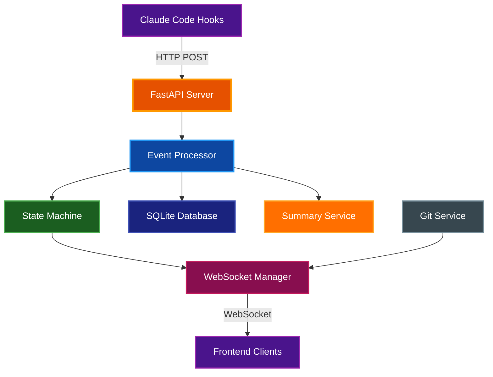

# Claude Office Visualizer Backend

FastAPI backend service that processes Claude Code hook events and broadcasts real-time state updates to connected frontend clients via WebSocket.

## Table of Contents

- [Overview](#overview)
- [Architecture](#architecture)
- [Prerequisites](#prerequisites)
- [Installation](#installation)
- [Running the Server](#running-the-server)
- [Configuration](#configuration)
- [API Endpoints](#api-endpoints)
- [Project Structure](#project-structure)
- [Testing](#testing)
- [Related Documentation](#related-documentation)

## Overview

The backend serves as the central hub for the Claude Office Visualizer:

- **Event Ingestion**: Receives lifecycle events from Claude Code hooks via HTTP POST
- **State Management**: Maintains office state through an event-driven state machine
- **Real-time Updates**: Broadcasts state changes to frontend clients via WebSocket
- **Persistence**: Stores sessions and events in SQLite for replay functionality
- **AI Summaries**: Generates human-readable descriptions using Claude Haiku API
- **Git Integration**: Polls git status for connected sessions

## Architecture



### Data Flow

1. Claude Code hooks send events to `/api/v1/events`
2. Event processor validates and enriches events (AI summaries, token usage)
3. State machine updates office state (boss, agents, context)
4. WebSocket manager broadcasts changes to connected clients
5. Events are persisted to SQLite for replay

### Task System Support

The backend supports two Claude Code task systems:

1. **TodoWrite Tool** (legacy): Tasks are sent via `pre_tool_use` events with `tool_name: "TodoWrite"`
2. **Task File System** (newer): Tasks are stored in `~/.claude/tasks/{session_id}/*.json`

Both systems are converted to the same `TodoItem` format for frontend display. The task file poller monitors the task directory and automatically syncs changes to the visualization.

**Task Persistence**: Tasks are persisted to the SQLite database when they change. This ensures tasks survive even if Claude Code removes them from the file system (e.g., when a session ends). When a session is restored, tasks are loaded from the database.

## Prerequisites

| Requirement | Version | Purpose |
|-------------|---------|---------|
| Python | 3.14+ | Runtime |
| uv | Latest | Package management |

## Installation

```bash
# From the backend directory
uv sync
```

This installs all dependencies defined in `pyproject.toml`.

## Running the Server

### Development Mode

```bash
# From the backend directory
make dev
```

Or directly with uv:

```bash
uv run uvicorn app.main:app --reload --host 0.0.0.0 --port 8000
```

### Production Mode

```bash
uv run uvicorn app.main:app --host 0.0.0.0 --port 8000
```

### With Static Frontend

When a built frontend exists in `backend/static/`, the server automatically serves it:

```bash
# Build frontend and copy to backend/static (from project root)
make build-static

# Run backend (serves both API and frontend)
uv run uvicorn app.main:app --host 0.0.0.0 --port 8000
```

## Configuration

Configuration is managed via environment variables or a `.env` file in the backend directory.

### Environment Variables

| Variable | Default | Description |
|----------|---------|-------------|
| `DATABASE_URL` | `sqlite+aiosqlite:///visualizer.db` | Database connection string |
| `GIT_POLL_INTERVAL` | `5` | Git status polling interval (seconds) |
| `CLAUDE_CODE_OAUTH_TOKEN` | (empty) | OAuth token for AI summaries |
| `SUMMARY_ENABLED` | `True` | Enable/disable AI summaries |
| `SUMMARY_MODEL` | `claude-haiku-4-5-20251001` | Model for summaries |
| `SUMMARY_MAX_TOKENS` | `1000` | Max tokens for summary responses |
| `CLAUDE_PATH_HOST` | (empty) | Host path prefix for Docker translation |
| `CLAUDE_PATH_CONTAINER` | (empty) | Container path prefix for Docker translation |

### Docker Path Translation

When running in Docker, the backend needs to translate file paths from host to container:

```bash
CLAUDE_PATH_HOST=/Users/username/.claude
CLAUDE_PATH_CONTAINER=/claude-data
```

## API Endpoints

### Health Check

| Method | Path | Description |
|--------|------|-------------|
| `GET` | `/health` | Server health status |

### Status

| Method | Path | Description |
|--------|------|-------------|
| `GET` | `/api/v1/status` | Server status including AI summary availability |

### Events

| Method | Path | Description |
|--------|------|-------------|
| `POST` | `/api/v1/events` | Receive events from Claude Code hooks |

### Sessions

| Method | Path | Description |
|--------|------|-------------|
| `GET` | `/api/v1/sessions` | List all sessions |
| `DELETE` | `/api/v1/sessions` | Clear all sessions and events |
| `GET` | `/api/v1/sessions/{id}` | Get session details |
| `DELETE` | `/api/v1/sessions/{id}` | Delete a single session |
| `GET` | `/api/v1/sessions/{id}/replay` | Get replay data for a session |
| `POST` | `/api/v1/sessions/simulate` | Start background simulation |

### Preferences

| Method | Path | Description |
|--------|------|-------------|
| `GET` | `/api/v1/preferences` | Get all user preferences |
| `GET` | `/api/v1/preferences/{key}` | Get a single preference |
| `PUT` | `/api/v1/preferences/{key}` | Set a preference value |
| `DELETE` | `/api/v1/preferences/{key}` | Delete a preference |

Preferences are stored as key-value pairs and persist across sessions. Current preferences:
- `clock_type`: `"analog"` or `"digital"`
- `clock_format`: `"12h"` or `"24h"` (for digital clock)

### WebSocket

| Path | Description |
|------|-------------|
| `/ws/{session_id}` | Real-time state updates for a session |

## Supported Event Types

The backend processes the following event types from Claude Code hooks:

| Event Type | Description | State Machine Effect |
|------------|-------------|---------------------|
| `session_start` | New Claude Code session begins | Initialize office, boss arrives |
| `session_end` | Session terminates | Cleanup, boss leaves |
| `pre_tool_use` | Tool execution starting | Boss/agent shows working state |
| `post_tool_use` | Tool execution completed | Update tool usage stats, file edits |
| `user_prompt_submit` | User sends a prompt | Phone rings, boss receives task |
| `permission_request` | Tool needs user approval | Show waiting state |
| `notification` | System notification | Display notification |
| `stop` | Session completing | Boss shows completion message |
| `subagent_start` | Task tool spawns agent | Create employee agent |
| `subagent_info` | Native agent ID available | Link agent to Claude's ID |
| `subagent_stop` | Task agent completes | Agent returns work, departs |
| `context_compaction` | Context window compacted | Coffee break animation |
| `background_task_notification` | Background task completed | Update remote workers display |

## Project Structure

```
backend/
├── app/
│   ├── api/
│   │   ├── routes/
│   │   │   ├── events.py      # Event ingestion endpoint
│   │   │   └── sessions.py    # Session management endpoints
│   │   └── websocket.py       # WebSocket connection manager
│   ├── core/
│   │   ├── constants.py       # Shared constants
│   │   ├── event_processor.py # Event validation and processing
│   │   ├── jsonl_parser.py    # Claude transcript parsing
│   │   ├── office_layout.py   # Office layout constants and zones
│   │   ├── path_utils.py      # File path utilities
│   │   ├── quotes.py          # Loading screen quotes
│   │   ├── state_machine.py   # Office state management
│   │   ├── summary_service.py # AI-powered summaries
│   │   ├── task_file_poller.py # Claude task file monitoring
│   │   ├── task_persistence.py # Task database persistence
│   │   └── transcript_poller.py # Token usage extraction
│   ├── db/
│   │   ├── database.py        # SQLAlchemy async setup
│   │   └── models.py          # Database models
│   ├── models/
│   │   ├── agents.py          # Agent state models
│   │   ├── common.py          # Shared Pydantic models
│   │   ├── events.py          # Event type models
│   │   ├── git.py             # Git status models
│   │   └── sessions.py        # Session state models
│   ├── services/
│   │   └── git_service.py     # Git status polling service
│   ├── config.py              # Settings management
│   └── main.py                # FastAPI application entry point
├── tests/
│   ├── conftest.py            # Test fixtures
│   ├── test_api.py            # API endpoint tests
│   ├── test_jsonl_parser.py   # JSONL parser tests
│   ├── test_path_utils.py     # Path utility tests
│   ├── test_quotes.py         # Quotes module tests
│   ├── test_state_machine.py  # State machine tests
│   ├── test_summary_service.py # Summary service tests
│   ├── test_task_file_poller.py # Task file polling tests
│   ├── test_task_persistence.py # Task database persistence tests
│   └── test_transcript_poller.py # Transcript polling tests
├── pyproject.toml             # Project dependencies
├── Makefile                   # Development commands
└── README.md                  # This file
```

## Testing

```bash
# Run all tests
make test

# Run with coverage
uv run pytest --cov=app

# Run specific test file
uv run pytest tests/test_state_machine.py

# Run specific test
uv run pytest tests/test_state_machine.py::test_agent_lifecycle
```

### Code Quality

```bash
# Run all checks (format, lint, typecheck, test)
make checkall

# Individual commands
make fmt        # Format with ruff
make lint       # Lint with ruff
make typecheck  # Type check with pyright
```

## Related Documentation

- [Project README](../README.md) - Project overview
- [Architecture](../docs/ARCHITECTURE.md) - System design details
- [Quick Start](../docs/QUICKSTART.md) - Getting started guide
- [Docker Guide](../docs/DOCKER.md) - Container deployment
- [AI Summary](../docs/AI_SUMMARY.md) - AI summary service documentation
