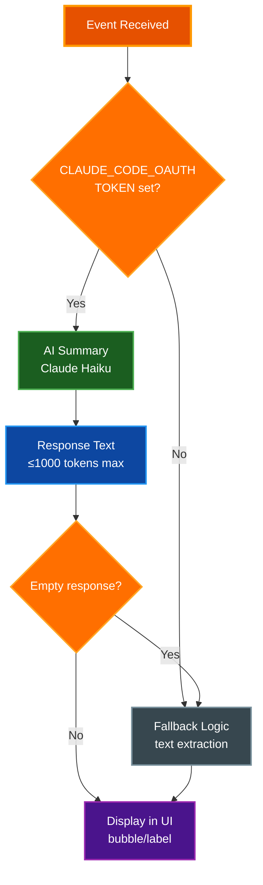

# AI Summary Service Documentation

This document describes the AI-powered summary system used in Claude Office Visualizer to generate concise descriptions for tool calls, agent tasks, and Claude responses.

## Overview

The `SummaryService` (`backend/app/core/summary_service.py`) provides AI-powered text summarization using Claude Haiku. When AI is unavailable, it falls back to simple text extraction methods.

## Configuration

| Environment Variable | Purpose | Default |
|---------------------|---------|---------|
| `CLAUDE_CODE_OAUTH_TOKEN` | OAuth token for Claude API access | None (disables AI) |
| `SUMMARY_ENABLED` | Enable/disable summary service | `True` |
| `SUMMARY_MODEL` | Model to use for summaries | `claude-haiku-4-5-20251001` |
| `SUMMARY_MAX_TOKENS` | Max tokens for summary responses | `1000` |

## API Methods

### 1. `summarize_tool_call(tool_name, tool_input)`

Generates a short summary of what a tool call does.

**Prompt:**
```
In 10 words or less, what does this {tool_name} tool call do?
{input_json}
```

**Input Truncation:** 500 characters max

**Fallback Logic:**
- `Read/Glob/Grep/Write/Edit`: Returns compressed file path (home → `~`, truncate from start)
- `Bash`: Returns first line of command (max 40 chars)
- `Task`: Returns first sentence of description (max 40 chars)
- `WebSearch`: Returns `"Search: {query}"` (max 35 chars)
- `WebFetch`: Returns `"Fetch: {domain}"`
- Other: Returns tool name

**Status:** Defined but not currently called in production code.

---

### 2. `summarize_agent_task(task_description)`

Generates a short summary of a subagent's task.

**Prompt:**
```
In 10 words or less, summarize this task:
{task_description}
```

**Input Truncation:** 1000 characters max

**Fallback:** First sentence of description (max 50 chars)

**Called From:** `_enrich_agent_with_summaries()` in `event_processor.py` when a subagent spawns

---

### 3. `summarize_user_prompt(prompt)`

Generates a summary of the user's prompt for display in the scrolling marquee.

**Prompt:**
```
In one sentence, summarize what this request asks for:
{prompt}
```

**Input Truncation:** 1500 characters max

**Short-circuit:** Returns original prompt if ≤120 chars and single sentence

**Fallback:** First sentence of prompt (max 150 chars)

**Called From:** `_process_event_internal()` in `event_processor.py` on `USER_PROMPT_SUBMIT` events

---

### 4. `generate_agent_name(description)`

Generates a fun, creative nickname for an agent based on its task.

**Prompt:**
```
Create a 1-3 word nickname that DIRECTLY relates to the task below. Extract the KEY ACTION or SUBJECT from the task and build the name around it. Examples: 'migrate YAML config' -> YAML Yoda or Config King; 'write unit tests' -> Test Pilot; 'fix database queries' -> Query Queen; 'update documentation' -> Doc Holiday; 'debug auth issue' -> Bug Bounty. The name MUST reference the main subject (YAML, tests, database, docs, etc). Use puns, pop culture, or alliteration. Max 15 chars. Task: {description}
Nickname:
```

**Input Truncation:** 500 characters max

**Post-processing:**
1. Remove quotes, punctuation, and extra whitespace
2. Filter out single-character words
3. Reject responses with > 3 words or > 20 characters (use fallback instead)
4. Take at most 3 words
5. Enforce max 15 characters (truncate to fewer words if exceeds)

**Fallback Logic (`generate_agent_name_fallback`):**
Generates fun, creative names by matching task keywords to themed name lists:

| Task Category | Keywords | Example Names |
|---------------|----------|---------------|
| Review/QA | review, audit, inspect, qa, quality | Judge Judy, The Critic, Hawkeye, Inspector G, The Auditor |
| Testing | test, spec, assert, expect | Test Pilot, Dr. Test, QA Queen, Bug Buster, Test Dummy |
| Validation | validate, verify, check, ensure | The Checker, Validator V, Fact Checker, Truth Seeker |
| Cleaning | clean, cleanup, tidy, organize | The Cleaner, Mr. Clean, Tidy Bot, Neat Freak |
| Formatting | format, prettier, lint, style | Style Guru, Format King, Lint Lord, Pretty Boy |
| Refactoring | refactor, restructure, reorganize | The Architect, Refactor Rex, Code Ninja, Dr. Refactor |
| Debugging | debug, diagnose, troubleshoot | Bug Hunter, Dr. Debug, Sherlock, The Debugger |
| Fixing | fix, repair, patch, resolve | The Fixer, Patch Adams, Mr. Fixit, Bug Squasher |
| Documentation | doc, document, readme, comment | The Scribe, Doc Brown, Word Wizard, Note Taker |
| Writing | write, create, draft, compose | The Writer, Wordsmith, Pen Pal, Script Kid |
| Research | research, investigate, explore, analyze | The Scout, Explorer X, Data Digger, Researcher R |
| Search | search, find, locate, discover | The Seeker, Finder Fred, Search Bot, Tracker T |
| Building | build, implement, create, develop | The Builder, Code Monkey, Dev Dawg, Maker Mike |
| Setup | setup, configure, install, init | Setup Sam, Config Kid, Init Ian, Boot Boss |
| Type checking | type, typecheck, typing, pyright, mypy | Type Tyrant, Type Cop, Type Ninja, Mr. Strict |
| Migration | migrate, upgrade, update, convert | The Migrator, Upgrade Ulysses, Version Vic, Update Ursula |
| Performance | optimize, performance, speed, fast | Speed Demon, Turbo T, Optimizer O, Fast Freddy |
| Security | security, secure, vulnerability, auth | Security Sam, Guard Dog, Sec Spec, Lock Smith |
| Database | database, sql, query, migration | Data Dan, SQL Sally, Query Queen, DB Dude |
| API/Backend | api, endpoint, route, backend | API Andy, Route Runner, Backend Bob, Endpoint Ed |
| Frontend/UI | frontend, ui, component, react, css | UI Ursula, Pixel Pete, Front Fred, Style Steve |
| Generic | (no match) | Code Cadet, Bit Buddy, Logic Larry, Algo Al, Helper Bot, Task Force, Agent X, The Intern, Worker Bee, Minion |

Names are randomly selected from each category for variety.

**Called From:**
- `_enrich_agent_with_summaries()` in `event_processor.py` when a subagent spawns
- `_create_agent()` in `state_machine.py` for immediate short name generation

---

### 5. `summarize_response(response_text)`

Generates a short summary of Claude's response for speech bubbles.

**Prompt:**
```
In 15 words or less, summarize this response:
{response_text}
```

**Input Truncation:** 2000 characters max

**Fallback:** First sentence of response (max 100 chars)

**Called From:**
- `_extract_and_set_boss_speech()` in `event_processor.py` - Boss speech bubble when session stops
- `_extract_and_set_agent_speech()` in `event_processor.py` - Agent speech bubble when subagent stops

---

### 6. `detect_report_request(prompt)`

Detects if the user's prompt requests a report or document to be created.

**Prompt:**
```
Does this request ask for a report, document, or documentation to be created? Reply with ONLY 'yes' or 'no':
{prompt}
```

**Input Truncation:** 1000 characters max

**Fallback Logic:**
- Keyword search for: report, document, documentation, readme, write up, writeup, summary report, pdf, markdown file, md file, .md, architecture, changelog, contributing, license, guide
- Pattern matching for: "create/write/generate/update/add ... .md"

**Called From:** `_detect_and_set_print_report()` in `event_processor.py` on `STOP` events

---

## API Call Details

### Model Configuration
- **Model:** Configurable via `SUMMARY_MODEL` setting
- **Max Tokens:** Configurable via `SUMMARY_MAX_TOKENS` setting (default: 1000)
- **Retries:** 1 retry on failure, then fallback

### Authentication
Uses `CLAUDE_CODE_OAUTH_TOKEN` as bearer auth for Claude Code Max subscription access.

### Console Output
When summaries are enabled, the service logs a clear banner at startup:
```
==================================================
AI SUMMARIES ENABLED
  Model: claude-haiku-4-5-20251001
  Max tokens: 1000
==================================================
```

### Error Handling
The service gracefully falls back to text extraction when:
- API call fails (after 1 retry)
- AI returns an empty response
- AI response has no content

```python
async def _call_with_retry(self, prompt: str, max_retries: int = 1) -> str | None:
    for attempt in range(max_retries + 1):
        try:
            response = await self.client.messages.create(...)
            text = response.content[0].text.strip()
            # Return None for empty responses to trigger fallback
            if text:
                return text
            logger.debug("AI returned empty response, using fallback")
            return None
        except Exception as e:
            if attempt < max_retries:
                logger.warning(f"Summary API error, retrying: {e}")
            else:
                logger.debug(f"Summary API failed after retry, using fallback: {e}")
                return None
```

---

## Helper Methods

### Path Utilities (in `path_utils.py`)

#### `compress_path(path, max_len=35)`
Compresses file paths for display:
1. Replace home directory with `~`
2. If still too long, truncate from BEGINNING (preserves filename)
3. Prepend `...` to truncated paths

#### `compress_paths_in_text(text)`
Replaces all occurrences of home directory with `~` in any text.

#### `truncate_long_words(text, max_len=30)`
Truncates individual words that are too long, preserving the rest of the text.

### Summary Service Methods

#### `_extract_first_sentence(text, max_len=100)`
Extracts first sentence for fallback summaries:
1. Find first `.`, `!`, or `?` after at least 10 characters
2. If no sentence end found, truncate at max_len with `...`

---

## Usage Flow



---

## Related Documentation

- [Architecture](ARCHITECTURE.md) - System design and component overview
- [PRD](../PRD.md) - Full product requirements including AI summary integration
