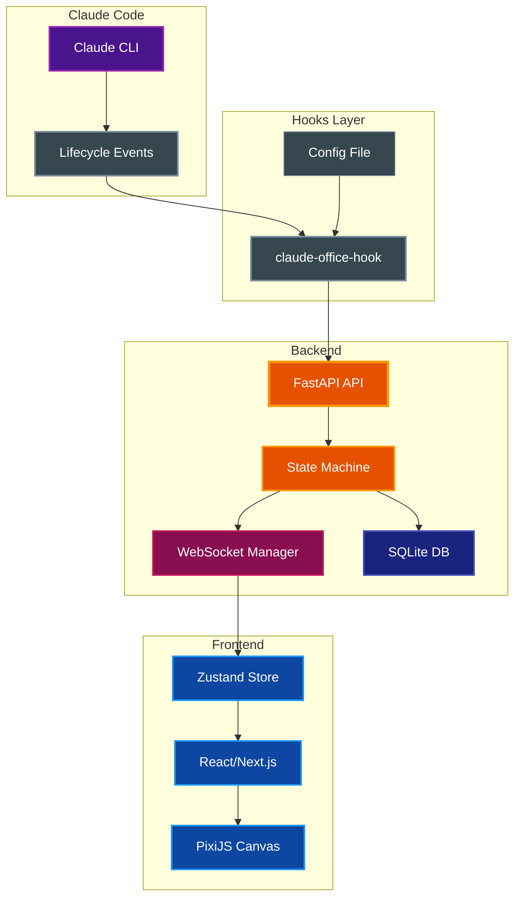
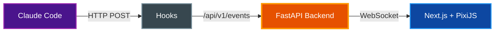
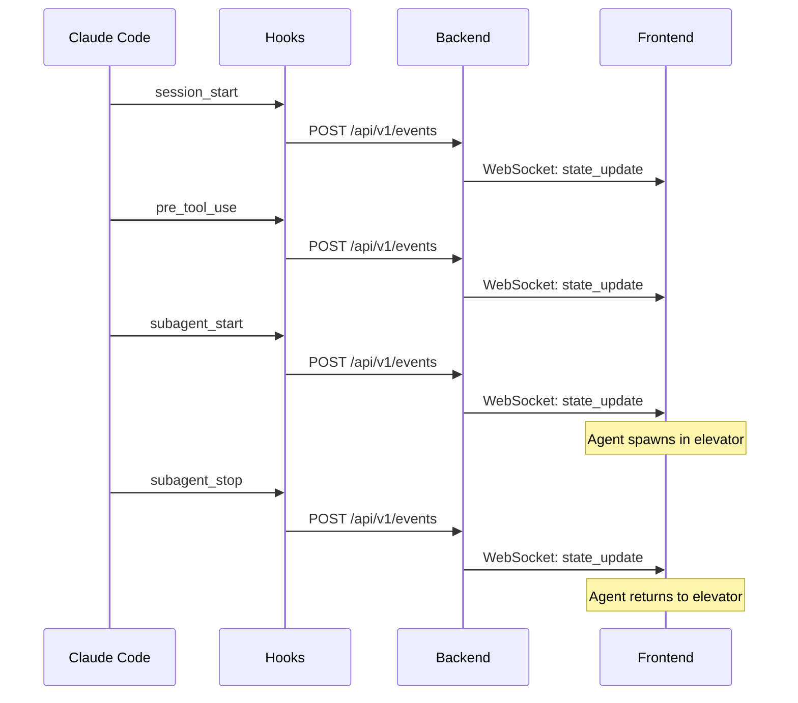
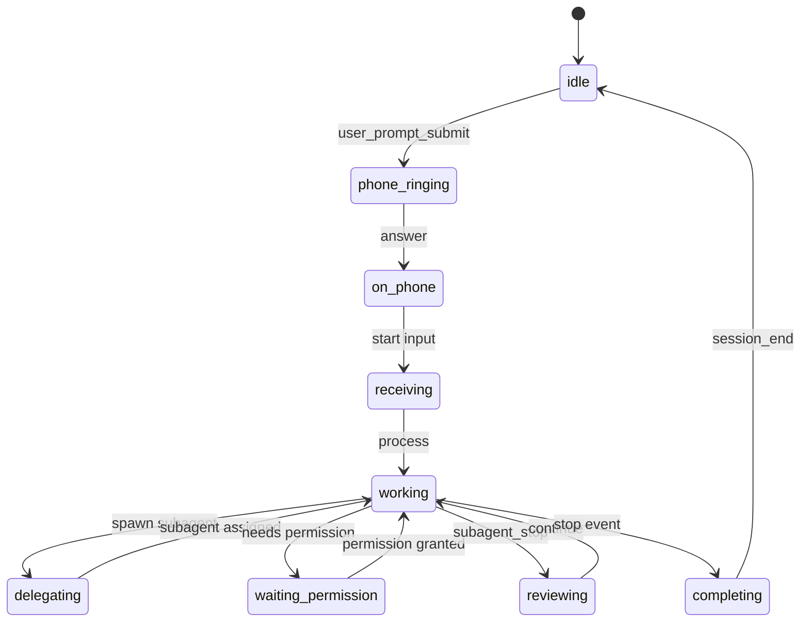

# Architecture

System architecture and design documentation for Claude Office Visualizer.

## Table of Contents

- [Overview](#overview)
- [System Architecture](#system-architecture)
- [Data Flow](#data-flow)
- [Components](#components)
- [Event System](#event-system)
- [Mid-Session Joining](#mid-session-joining)
- [Frontend State Management](#frontend-state-management)
- [Boss State Machine](#boss-state-machine)
- [Work Acceptance Quotes](#work-acceptance-quotes)
- [Work Completion Quotes](#work-completion-quotes)
- [Context Compaction Animation](#context-compaction-animation)
- [Printer Animation](#printer-animation)
- [City Skyline Window](#city-skyline-window)
- [Wall Clock](#wall-clock)
- [User Preferences](#user-preferences)
- [PixiJS Rendering](#pixijs-rendering)
- [Related Documentation](#related-documentation)

## Overview

Claude Office Visualizer transforms Claude Code operations into a real-time pixel art office simulation. A "boss" character (main Claude agent) manages work, spawns "employee" agents (subagents), and orchestrates tasks visually.

**Design Principle:** The backend is the source of truth. The frontend is a "dumb" renderer that displays whatever state it receives via WebSocket.

## System Architecture



## Data Flow



**Flow sequence:**
1. Claude Code hooks capture lifecycle events (tool use, subagent spawning)
2. Hooks POST events to backend API
3. Backend state machine transforms events into game state changes
4. State updates broadcast to frontend via WebSocket
5. Frontend renders state using PixiJS

## Components

### Backend (`backend/app/`)

| File | Purpose |
|------|---------|
| `core/state_machine.py` | Transforms CLI events into game state; manages agent lifecycle, desk assignments, animations |
| `core/event_processor.py` | Routes incoming events to state machine, persists to DB |
| `core/summary_service.py` | AI-powered summarization for agent tasks and prompts |
| `core/transcript_poller.py` | Polls Claude Code JSONL transcript files for token usage |
| `core/jsonl_parser.py` | Parses Claude Code JSONL transcript format |
| `core/quotes.py` | Quote generation for boss completion messages |
| `core/office_layout.py` | Desk and position constants |
| `core/path_utils.py` | Path utilities for transcript file handling |
| `api/websocket.py` | Connection manager for broadcasting state updates |
| `models/agents.py` | Agent, Boss, Office state models |
| `models/events.py` | Event and EventData models |
| `models/sessions.py` | GameState and session models |
| `models/common.py` | Shared models (BubbleContent, SpeechContent) |
| `models/git.py` | Git status models |

### Frontend (`frontend/src/`)

| File | Purpose |
|------|---------|
| `components/game/OfficeGame.tsx` | Main PixiJS canvas, renders boss, agents, office |
| `components/game/OfficeBackground.tsx` | Office floor, walls, and static decor |
| `components/game/BossSprite.tsx` | Boss character with typing animation and MobileBoss for compaction |
| `components/game/AgentSprite.tsx` | Agent characters with walk/idle/typing animations |
| `components/game/DeskGrid.tsx` | Agent desk arrangement and positioning |
| `components/game/DeskMarquee.tsx` | Scrolling text marquee for agent task display |
| `components/game/MarqueeText.tsx` | Reusable scrolling text component |
| `components/game/TrashCanSprite.tsx` | Context utilization visualization with stomp effect |
| `components/game/CityWindow.tsx` | City skyline with real-time day/night cycle |
| `components/game/EmployeeOfTheMonth.tsx` | Employee of the Month wall poster |
| `components/game/Whiteboard.tsx` | Multi-mode display with 11 visualization modes (see [WHITEBOARD.md](WHITEBOARD.md)) |
| `components/game/SafetySign.tsx` | Tool counter since last compaction |
| `components/game/PrinterStation.tsx` | Animated printer for report generation |
| `components/game/Elevator.tsx` | Agent arrival/departure elevator with doors |
| `components/game/WallClock.tsx` | Clickable wall clock (analog/digital modes) |
| `components/game/DigitalClock.tsx` | LED-style digital clock display |
| `components/game/DebugOverlays.tsx` | Development debug visualizations |
| `components/game/LoadingScreen.tsx` | Loading state display |
| `components/game/ZoomControls.tsx` | Canvas zoom controls |
| `components/game/EventLog.tsx` | Event history display panel |
| `components/game/GitStatusPanel.tsx` | Git repository status display |
| `components/game/AgentStatus.tsx` | Agent status indicators |
| `stores/gameStore.ts` | Unified Zustand store for all game state (includes bubble queue) |
| `stores/preferencesStore.ts` | User preferences store (clock type, format) |
| `systems/compactionAnimation.ts` | Boss stomp animation when context compacts |
| `systems/animationSystem.ts` | Single RAF loop for all movement and timing |
| `systems/pathfinding.ts` | A* pathfinding with navigation grid |
| `systems/astar.ts` | A* algorithm implementation |
| `systems/navigationGrid.ts` | Grid-based navigation obstacles |
| `systems/pathSmoothing.ts` | Path smoothing for natural movement |
| `systems/agentCollision.ts` | Agent collision detection |
| `systems/queuePositions.ts` | Queue position management for arrivals and departures |
| `systems/hmrCleanup.ts` | Hot module replacement cleanup |
| `hooks/useWebSocketEvents.ts` | WebSocket handler with state machine integration |
| `hooks/useOfficeTextures.ts` | Texture loading and caching |
| `types/index.ts` | TypeScript types matching backend Pydantic models |

### Hooks (`hooks/src/claude_office_hooks/`)

| File | Purpose |
|------|---------|
| `main.py` | Event mapper; converts Claude Code hook data to backend Event format |

**Hook Design Principle:** Hooks must stay lightweight and fast. They should only:
- Pass along data already present in the JSON payload from Claude Code
- Perform minimal transformations (e.g., field renaming, timestamp formatting)
- Never read files, parse transcripts, or do heavy processing

If data needs to be extracted from JSONL transcript files (e.g., token usage, thinking blocks), that extraction belongs in the **backend**, not the hooks.

## Event System

### Event Types

Events flow from Claude Code hooks through the backend to the frontend:

| Event Type | Description |
|------------|-------------|
| `session_start` | Claude Code session begins |
| `session_end` | Claude Code session ends |
| `pre_tool_use` | Tool execution starting |
| `post_tool_use` | Tool execution completed |
| `user_prompt_submit` | User submitted a prompt |
| `permission_request` | Claude needs user permission |
| `notification` | System notification from Claude Code |
| `subagent_start` | Task tool spawning a subagent |
| `subagent_info` | Updates agent with native_agent_id and transcript path |
| `subagent_stop` | Subagent completing work |
| `background_task_notification` | Background task completed or failed |
| `agent_update` | Agent state update |
| `context_compaction` | Context window was compacted |
| `stop` | Main agent completing work |
| `cleanup` | Logical removal of agent after departure |
| `reporting` | Agent reporting to boss |
| `walking_to_desk` | Agent walking to desk |
| `waiting` | Agent waiting for work |
| `leaving` | Agent leaving office |
| `error` | Error event |

Agent IDs use format `subagent_{tool_use_id}` to correlate start/stop events.

### Event Flow Sequence



## Mid-Session Joining

When a client connects to an active session (or switches sessions), agents appear at their correct positions rather than re-animating from the elevator.

**Backend State:**
```typescript
interface GameState {
  // ... other fields
  arrivalQueue: string[];    // Agent IDs in arrival queue
  departureQueue: string[];  // Agent IDs in departure queue
}
```

**Frontend Position Detection:**
| Condition | Spawn Position |
|-----------|----------------|
| Agent in `arrivalQueue` | Arrival queue slot (A1, A2, etc.) |
| Agent in `departureQueue` | Departure queue slot (D1, D2, etc.) |
| Agent has desk, not in queues | Desk position |
| Otherwise | Elevator spawn |

**Queue Lifecycle:**
1. `SUBAGENT_START` → Agent added to `arrivalQueue`
2. `PRE_TOOL_USE` → Agent removed from `arrivalQueue` (at desk)
3. `SUBAGENT_STOP` → Agent added to `departureQueue`
4. Agent enters elevator → Agent removed from `departureQueue`

**Implementation:**
- `backend/app/models/sessions.py` - GameState includes queue arrays
- `backend/app/core/state_machine.py` - Manages queue membership
- `frontend/src/hooks/useWebSocketEvents.ts` - Detects position on join
- `frontend/src/systems/queuePositions.ts` - Tracks occupied elevator positions

## Frontend State Management

All game state is managed in a single Zustand store (`gameStore.ts`). Use individual selectors to prevent re-render loops:

```typescript
// Good - stable primitive selector
const isConnected = useGameStore((state) => state.isConnected);

// Good - use exported selectors for consistency
const agents = useGameStore(selectAgents);
const boss = useGameStore(selectBoss);

// Bad - returns new object reference every render
const { boss, agents } = useGameStore((state) => ({ boss: state.boss, agents: state.agents }));
```

**Key State Areas:**
- Agent animation state (position, phase, bubbles)
- Boss state (backend state, typing, task)
- Office state (elevator, phone, context utilization)
- Queues (arrival and departure queues)
- UI state (debug overlays, replay)

## Boss State Machine

The boss character has the following internal states (defined in `backend/app/models/agents.py`):

| State | Meaning |
|-------|---------|
| `idle` | Waiting, not doing anything |
| `phone_ringing` | Phone is ringing (incoming user prompt) |
| `on_phone` | Boss is on the phone with user |
| `receiving` | Actively receiving user input |
| `working` | Processing/executing tasks |
| `delegating` | Spawning subagents |
| `waiting_permission` | Waiting for user permission (AskUserQuestion tool) |
| `reviewing` | Reviewing completed work from agents |
| `completing` | Finishing up a task |



**Note:** The compaction animation (boss walking to trash can and jumping) is handled separately in the frontend via `CompactionAnimationPhase` in `gameStore.ts`, not as a boss state. See [Context Compaction Animation](#context-compaction-animation) for details.

## Work Acceptance Quotes

When agents receive work from the boss, they display a random quote from a pool of 100 phrases:

**Categories:** Enthusiastic, Professional, Casual, Motivated, Tech-themed, Office humor

**Implementation:**
- `frontend/src/constants/quotes.ts` - Quote definitions (`WORK_ACCEPTANCE_QUOTES` array)
- Random selection from the array when agent receives work

## Work Completion Quotes

When agents turn in completed work, they display a random quote from a pool of 100 phrases:

**Categories:** Presenting work, Proud, Confident, Casual handoff, Professional, Tech-themed, Playful, Relief, Short

**Implementation:**
- `frontend/src/constants/quotes.ts` - Quote definitions (`WORK_COMPLETION_QUOTES` array)
- `backend/app/core/quotes.py` - Backend quote generation for boss completion messages
- Displayed when agent reaches the departure ready spot

## Context Compaction Animation

When Claude Code performs context compaction (`context_compaction` event), the boss walks to the trashcan and stomps it empty:

**Animation Phases:**
1. `walking_to_trash` (800ms) - Boss leaves desk and walks to trashcan
2. `jumping` (36 seconds) - Boss jumps 36 times, each stomp reduces context incrementally until 0%
3. `walking_back` (800ms) - Boss returns to desk after context reaches 0%

**Implementation:**
- `systems/compactionAnimation.ts` - Animation state machine hook
- `BossSprite.tsx` - `MobileBoss` component renders boss body during animation
- `TrashCanSprite.tsx` - Squish effect on stomp

## Printer Animation

The printer animation triggers when:
1. The main agent completes (`stop` event, not `subagent_stop`)
2. The user's original prompt requested a report/document

Detection methods:
- **Primary (AI):** Asks Claude "Does this request ask for a report, document, or documentation to be created?"
- **Fallback (keywords):** Matches "report", "documentation", "readme", "architecture", "guide", ".md", or patterns like `create|write|generate|update|add` + `.md`

## City Skyline Window

The city window shows an animated skyline with real-time day/night cycle based on the current season:

**Time Periods (vary by season):**

| Period | Features |
|--------|----------|
| Night  | Stars, moon arc, lit windows (35% lit probability) |
| Dawn   | Rising sun, gradient transition (20% lit probability) |
| Day    | Sun arc, animated drifting clouds, few lit windows (5% lit probability) |
| Dusk   | Setting sun, gradient transition (30% lit probability) |

**Animated Clouds:**
- Two clouds drift slowly across the sky during daytime
- Top cloud moves slower than bottom cloud (parallax effect)
- Clouds are clipped to window bounds using PixiJS mask

**Seasonal Variations:**

| Season | Dawn            | Dusk            |
|--------|-----------------|-----------------|
| Winter | 6:30am - 8:00am | 4:30pm - 6:30pm |
| Spring | 5:30am - 7:00am | 6:00pm - 8:30pm |
| Summer | 4:30am - 6:00am | 7:30pm - 9:30pm |
| Fall   | 6:00am - 7:30am | 5:30pm - 7:30pm |

**Building Lights:**
- Window lit probability varies by time of day
- Session-based seed ensures each session has unique but stable light patterns
- Seed falls back to date-based if no session ID (pattern changes daily)
- Individual lights randomly toggle on/off every 1-3 minutes
- Creates a "living city" effect where occupants come and go
- Toggled state persists and accumulates during session

**Debug:** Press `D` then `T` to fast-forward (full 24-hour cycle in ~12 seconds)

## Wall Clock

The wall clock supports multiple display modes:

| Mode | Description |
|------|-------------|
| Analog | Traditional clock face with hour, minute, and second hands |
| Digital 12h | LED-style display with AM/PM indicator |
| Digital 24h | LED-style display with 24-hour format |

**Interaction:** Click the clock to cycle through modes (analog → digital 12h → digital 24h → analog)

**Persistence:** Clock preferences are stored in the backend database and persist across sessions.

## User Preferences

User preferences are stored in the backend SQLite database as key-value pairs:

| Key | Values | Description |
|-----|--------|-------------|
| `clock_type` | `analog`, `digital` | Wall clock display mode |
| `clock_format` | `12h`, `24h` | Digital clock time format |

**API Endpoints:**
- `GET /api/v1/preferences` - Get all preferences
- `PUT /api/v1/preferences/{key}` - Set a preference

**Frontend:** The `preferencesStore.ts` Zustand store manages preference state and syncs with the backend.

## PixiJS Rendering

### Sharp Text at 2x

For crisp text rendering in PixiJS, render text at 2x size and scale down:

```tsx
// Render at 2x fontSize, scale container to 0.5
<pixiContainer scale={0.5}>
  <pixiText
    text="Sharp text"
    style={{ fontSize: 24 }}  // 2x the desired 12px size
    resolution={2}
  />
</pixiContainer>
```

This produces sharper text than rendering at native size. Apply to all in-scene text (labels, bubbles, UI elements).

### Sprite Art Style

- 45-degree front/top-down perspective (NOT isometric)
- Magenta (#FF00FF) chroma key background for transparency
- 16-bit retro pixel art aesthetic
- Tintable items rendered WHITE/GRAYSCALE for runtime color variation

## Related Documentation

- [README.md](../README.md) - Project overview and quick start
- [CLAUDE.md](../CLAUDE.md) - AI assistant instructions and commands
- [WHITEBOARD.md](WHITEBOARD.md) - Whiteboard multi-mode display documentation
- [Claude Code JSONL Format](research/claude-code-jsonl-format.md) - Transcript file format research
