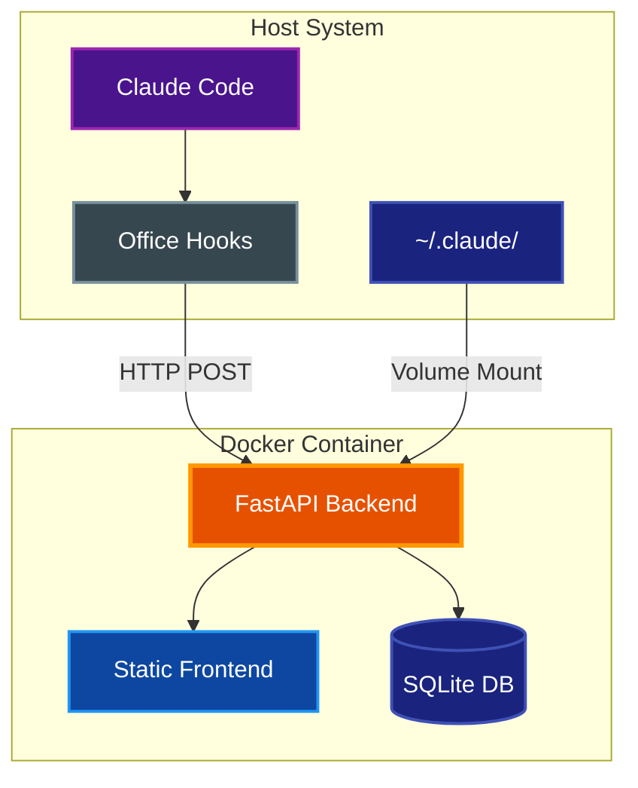
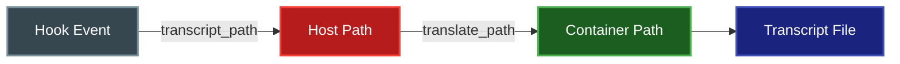
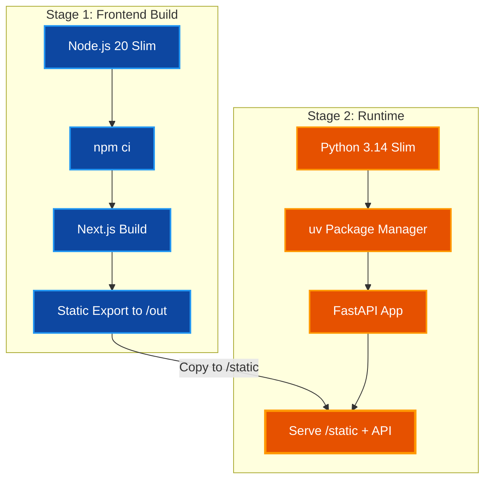

# Docker Deployment

Guide for deploying Claude Office Visualizer using Docker containers.

## Table of Contents

- [Overview](#overview)
- [Prerequisites](#prerequisites)
- [Quick Start](#quick-start)
- [Configuration](#configuration)
- [Architecture](#architecture)
- [Building](#building)
- [Running](#running)
- [Troubleshooting](#troubleshooting)
- [Related Documentation](#related-documentation)

## Overview

Claude Office Visualizer can be deployed as a single Docker container that serves both the FastAPI backend and the pre-built Next.js frontend. The container requires read access to Claude Code's data directory to extract token usage from transcript files.



> **Note:** The Claude Code hooks always run natively on the host system - only the backend and frontend are containerized.

## Prerequisites

- Docker Engine 20.10+ or Docker Desktop
- Docker Compose V2
- Claude Code installed and configured on the host
- Claude Office hooks installed (`make hooks-install`)

## Quick Start

1. **Create environment file**

   ```bash
   cp .env.example .env
   ```

2. **Configure path translation**

   Edit `.env` and set your Claude data path:
   ```bash
   # macOS
   CLAUDE_PATH_HOST=/Users/yourusername/.claude

   # Linux
   CLAUDE_PATH_HOST=/home/yourusername/.claude
   ```

3. **Start the container**

   ```bash
   docker compose up -d
   ```

4. **Access the visualizer**

   Open [http://localhost:8000](http://localhost:8000) in your browser.

## Configuration

### Environment Variables

| Variable | Required | Default | Description |
|----------|----------|---------|-------------|
| `CLAUDE_PATH_HOST` | Yes | - | Absolute path to `~/.claude` on host system |
| `CLAUDE_PATH_CONTAINER` | No | `/claude-data` | Mount point inside container (hardcoded in compose) |
| `CLAUDE_DATA_DIR` | No | `~/.claude` | Host directory to mount (used in volume mount only) |
| `CLAUDE_CODE_OAUTH_TOKEN` | No | - | OAuth token for AI-powered summaries |
| `SUMMARY_ENABLED` | No | `true` | Enable/disable AI summaries |
| `SUMMARY_MODEL` | No | `claude-haiku-4-5-20251001` | Model for AI summaries (set in `.env`) |
| `SUMMARY_MAX_TOKENS` | No | `1000` | Max tokens for summary responses (set in `.env`) |
| `DATABASE_URL` | No | `sqlite+aiosqlite:///app/data/visualizer.db` | Database connection string |
| `GIT_POLL_INTERVAL` | No | `5` | Git status polling interval in seconds (set in `.env`) |

### Example `.env` File

```bash
# Required: Path translation for Docker
# Set this to the full path of your .claude directory
CLAUDE_PATH_HOST=/Users/yourusername/.claude

# Optional: Enable AI summaries (requires Claude API access)
# CLAUDE_CODE_OAUTH_TOKEN=your-oauth-token-here

# Optional: Disable AI summaries
# SUMMARY_ENABLED=false

# Optional: Configure summary model
# SUMMARY_MODEL=claude-haiku-4-5-20251001
```

### Path Translation

When running in Docker, the backend receives file paths from hooks that reference the host filesystem. The path translation system converts these host paths to container paths:



**Example:**
- Hook sends: `/Users/probello/.claude/projects/myproject/session.jsonl`
- `CLAUDE_PATH_HOST`: `/Users/probello/.claude`
- `CLAUDE_PATH_CONTAINER`: `/claude-data`
- Translated: `/claude-data/projects/myproject/session.jsonl`

## Architecture

### Multi-Stage Build

The Dockerfile uses a multi-stage build for optimal image size:



### Volume Mounts

| Mount | Purpose | Mode |
|-------|---------|------|
| `~/.claude:/claude-data` | Claude Code transcripts | Read-only |
| `claude-office-db:/app/data` | SQLite database | Read-write |

## Building

### Build the Image

```bash
# Build with default tag
docker compose build

# Build with custom tag
docker build -t claude-office:v1.0.0 .
```

### Build Arguments

The Dockerfile does not currently use build arguments, but you can extend it:

```dockerfile
ARG PYTHON_VERSION=3.14
FROM python:${PYTHON_VERSION}-slim AS runtime
```

## Running

### Using Docker Compose

```bash
# Start in foreground
docker compose up

# Start in background
docker compose up -d

# View logs
docker compose logs -f

# Stop
docker compose down

# Stop and remove volumes
docker compose down -v
```

### Using Docker CLI

```bash
# Run directly
docker run -d \
  --name claude-office \
  -p 8000:8000 \
  -v ~/.claude:/claude-data:ro \
  -v claude-office-db:/app/data \
  -e CLAUDE_PATH_HOST=/Users/yourusername/.claude \
  -e CLAUDE_PATH_CONTAINER=/claude-data \
  claude-office:latest
```

### Health Checks

The container includes a health check that verifies the API is responding:

```bash
# Check container health
docker inspect --format='{{.State.Health.Status}}' claude-office

# View health check logs
docker inspect --format='{{json .State.Health}}' claude-office | jq
```

## Troubleshooting

### Container Won't Start

**Symptom:** Container exits immediately after starting.

**Solution:** Check the logs for errors:
```bash
docker compose logs claude-office
```

Common causes:
- Missing environment variables
- Invalid `CLAUDE_PATH_HOST` path
- Port 8000 already in use

### Transcript Files Not Found

**Symptom:** Context utilization shows 0% despite active sessions.

**Solution:** Verify path translation is configured correctly:

1. Check the mounted volume:
   ```bash
   docker exec claude-office ls -la /claude-data
   ```

2. Verify `CLAUDE_PATH_HOST` matches your system:
   ```bash
   echo $HOME/.claude
   ls -la ~/.claude
   ```

3. Ensure the volume mount is read-accessible:
   ```bash
   docker exec claude-office cat /claude-data/settings.json
   ```

### Connection Refused from Hooks

**Symptom:** Hooks fail with "connection refused" errors.

**Solution:** Ensure the container is running and accessible:

1. Check container status:
   ```bash
   docker ps | grep claude-office
   ```

2. Verify port binding:
   ```bash
   curl http://localhost:8000/health
   ```

3. Check hook configuration points to `localhost:8000`

### Database Permission Errors

**Symptom:** Errors about SQLite database being read-only.

**Solution:** Check volume permissions:

```bash
# Check volume
docker volume inspect claude-office-db

# Reset volume if needed
docker compose down -v
docker compose up -d
```

### Common Issues

| Issue | Solution |
|-------|----------|
| "No such file or directory" for transcripts | Verify `CLAUDE_PATH_HOST` is set correctly |
| WebSocket connection fails | Check CORS settings and container networking |
| AI summaries not working | Verify `CLAUDE_CODE_OAUTH_TOKEN` is set |
| Slow startup | First build downloads dependencies; subsequent starts are faster |

## Related Documentation

- [Architecture](ARCHITECTURE.md) - System design and component details
- [AI Summary Service](AI_SUMMARY.md) - AI summary configuration
- [README](../README.md) - Project overview and native development setup
