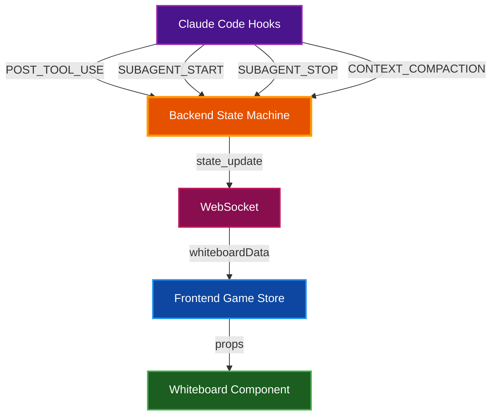

# Whiteboard Display System

The whiteboard is an interactive office element that displays session data in 10 different visualization modes. Click anywhere on the whiteboard to cycle through modes.

## Table of Contents

- [Overview](#overview)
- [Display Modes](#display-modes)
  - [Mode 0: Todo List](#mode-0-todo-list)
  - [Mode 1: Tool Use](#mode-1-tool-use)
  - [Mode 2: Org Chart](#mode-2-org-chart)
  - [Mode 3: Stonks](#mode-3-stonks)
  - [Mode 4: Weather](#mode-4-weather)
  - [Mode 5: Safety Board](#mode-5-safety-board)
  - [Mode 6: Timeline](#mode-6-timeline)
  - [Mode 7: News Ticker](#mode-7-news-ticker)
  - [Mode 8: Coffee Tracker](#mode-8-coffee-tracker)
  - [Mode 9: Heat Map](#mode-9-heat-map)
- [Data Flow](#data-flow)
- [Backend Tracking Logic](#backend-tracking-logic)
- [Related Documentation](#related-documentation)

## Overview

The whiteboard component visualizes real-time session metrics in whimsical, office-themed displays. Each mode transforms raw session data into an engaging visualization that reflects the current state of Claude Code operations.

**Interaction:** Click the whiteboard to cycle through modes (0 → 1 → 2 → ... → 9 → 0)

**Visual Elements:**
- Header bar showing current mode name and icon
- Mode indicator dots (10 dots at bottom, current mode highlighted)
- Marker tray with colored markers (decorative)

## Display Modes

### Mode 0: Todo List

**Icon:** `📋` **Name:** TODO

Displays the current task list from Claude's TodoWrite tool.

**Features:**
- Shows up to 5 todos at a time with auto-scroll
- Status icons: `○` pending, `▶` in progress, `✓` completed
- Color-coded by status (green=complete, blue=in-progress, gray=pending)
- Auto-centers on the currently in-progress task
- Shows page indicator when list exceeds 5 items

**Data Source:** `TodoWrite` tool calls parsed by the state machine

---

### Mode 1: Tool Use

**Icon:** `🍕` **Name:** TOOL USE

Pie chart visualization of tool usage by category.

**Categories:**

| Category | Tools | Color |
|----------|-------|-------|
| read | Read, Glob, Grep | Blue |
| write | Write | Green |
| edit | Edit | Amber |
| bash | Bash | Purple |
| task | Task | Pink |
| todo | TodoWrite | Cyan |
| web | WebSearch, WebFetch | Red |
| other | All others | Gray |

**Data Source:** `POST_TOOL_USE` events tracked by `_categorize_tool()`

---

### Mode 2: Org Chart

**Icon:** `📊` **Name:** ORG

Displays boss and subagent hierarchy with humorous job titles.

**Layout:**
- Boss at top with gold-bordered box (centered)
- Up to 4 subagents displayed below in 75px wide boxes
- Agent boxes are centered as a group with connecting lines
- Each agent shows name and a silly title

**Silly Titles:**
- VP of Grepping
- Chief Byte Wrangler
- Senior Code Whisperer
- Director of Semicolons
- Head of Tab Spaces
- Minister of Merge Conflicts
- Baron of Bug Fixes
- Duke of Documentation

**Data Source:** Current agent list and boss task from game store

---

### Mode 3: Stonks

**Icon:** `📈` **Name:** STONKS

Fake stock ticker displaying session productivity metrics.

**Tickers:**

| Symbol | Tracks | Description |
|--------|--------|-------------|
| $TASK | `taskCompletedCount` | Completed todos |
| $BUG | `bugFixedCount` | Bug fixes detected |
| $CAFE | `coffeeBreakCount` | Context compactions |
| $CODE | `codeWrittenCount` | Edit/Write operations |

**Features:**
- Prices fluctuate with animated noise
- Green up arrow when count > 0, red down arrow otherwise
- Mini sparkline chart for each ticker

**Data Sources:**
- `$TASK`: Count of todos with status "completed" from `TodoWrite`
- `$BUG`: Bash commands containing "fix" in command text
- `$CAFE`: Context compaction events
- `$CODE`: Edit and Write tool uses

---

### Mode 4: Weather

**Icon:** `🌤️` **Name:** WEATHER

Weather metaphor for session health based on success rate and activity.

**Weather Conditions:**

| Condition | Icon | Trigger |
|-----------|------|---------|
| Stormy | ⛈️ | More than 5 recent errors |
| Rainy | 🌧️ | Success rate below 70% |
| Cloudy | ⛅ | Activity level below 30% |
| Sunny | ☀️ | Default (healthy session) |

**Stats Displayed:**
- Success rate percentage
- Error count
- Activity level percentage
- Total operations count

**Data Sources:**
- Success rate: `recentSuccessCount / (recentSuccessCount + recentErrorCount)`
- Activity level: `toolUsesSinceCompaction / 100` (normalized)

---

### Mode 5: Safety Board

**Icon:** `⚠️` **Name:** SAFETY

Parody of workplace safety signs showing consecutive successful tool uses.

**Display:**
- Large counter showing consecutive successes
- "SUCCESSFUL TOOL USES" label
- Time since last incident (minutes/hours/days)

**Logic:**
- Counter increments on each successful `POST_TOOL_USE`
- Counter resets to 0 on any tool failure
- Last incident time recorded on failure

**Data Source:** `consecutiveSuccesses` and `lastIncidentTime` from state machine

---

### Mode 6: Timeline

**Icon:** `📅` **Name:** TIMELINE

Gantt chart showing agent lifespans and coffee breaks during the session.

**Features:**
- Shows last 5 agents with truncated name labels
- Horizontal bars colored by agent color
- Bar length represents active duration
- Green dot indicates still-active agents
- Coffee break markers (☕) shown as dashed brown vertical lines
- Timeline freezes after session ends (uses latest agent end time instead of current time)

**Visual Elements:**
- Agent labels: 70px left margin for readability
- Agent bars: Colored by agent, with rounded caps
- Active indicator: Green dot on bars without end time
- Coffee markers: Dashed vertical lines with ☕ icon at top

**Data Sources:**
- `agentLifespans` array populated on `SUBAGENT_START` and `SUBAGENT_STOP` events
- Coffee break timestamps extracted from `newsItems` with category "coffee"

---

### Mode 7: News Ticker

**Icon:** `📰` **Name:** NEWS

Breaking news headlines about session events.

**News Categories and Colors:**

| Category | Color | Triggers |
|----------|-------|----------|
| tool | Blue | Significant tool events |
| agent | Green | Agent joins/completes |
| session | Purple | Session start, job completion |
| error | Red | Tool failures |
| coffee | Amber | Context compaction |

**Features:**
- Cycles through news items every 4 seconds
- Shows timestamp for each headline
- "BREAKING" banner in red
- Keeps last 20 news items

**Example Headlines:**
- "🆕 Explorer-47 joins the team!"
- "✅ Code-reviewer completed their task!"
- "🎉 Job completed! Great work everyone!"
- "☕ Coffee break #3! Context compacted."
- "⚠️ Bash failed: permission denied"

---

### Mode 8: Coffee Tracker

**Icon:** `☕` **Name:** COFFEE

Tracks context compaction events as coffee breaks.

**Display:**
- Large number showing total cups
- Grid of coffee cup emojis (max 15 displayed)
- "+N" indicator if more than 15 cups

**Trigger:** Each `CONTEXT_COMPACTION` event increments the counter

**Data Source:** `coffeeCups` counter in state machine

---

### Mode 9: Heat Map

**Icon:** `🔥` **Name:** HEATMAP

Bar chart showing most-edited files during the session.

**Features:**
- Shows top 5 edited files
- Bar length proportional to edit count
- Color gradient based on edit frequency:
  - Red: >80% of max
  - Orange: >60% of max
  - Amber: >40% of max
  - Yellow: >20% of max
  - Blue: ≤20% of max

**Data Source:** `fileEdits` dict populated from Edit/Write tool `file_path` parameter

## Data Flow



## Backend Tracking Logic

The state machine tracks whiteboard data in the `transition()` method:

### Tool Categorization

Tools are grouped into categories for the pizza chart:

```python
tool_categories = {
    "Read": "read",
    "Glob": "read",
    "Grep": "read",
    "Write": "write",
    "Edit": "edit",
    "Bash": "bash",
    "Task": "task",
    "TodoWrite": "todo",
    "WebSearch": "web",
    "WebFetch": "web",
}
```

### Event Processing

| Event Type | Data Updated |
|------------|--------------|
| `POST_TOOL_USE` | Tool usage, success/error counts, file edits, code written |
| `SUBAGENT_START` | Agent lifespans, news items |
| `SUBAGENT_STOP` | Agent lifespans (end time), news items |
| `CONTEXT_COMPACTION` | Coffee cups, news items |
| `SESSION_START` | News items, resets counters |
| `STOP` | News items (job completion) |

### Success/Failure Tracking

```python
if success is False or error_type:
    recent_error_count += 1
    consecutive_successes = 0  # Reset safety counter
    last_incident_time = datetime.now().isoformat()
else:
    recent_success_count += 1
    consecutive_successes += 1
```

### File Edit Tracking

```python
if tool_name in ("Edit", "Write"):
    code_written_count += 1
    file_path = tool_input.get("file_path", "")
    if file_path:
        file_name = file_path.split("/")[-1]
        file_edits[file_name] = file_edits.get(file_name, 0) + 1
```

## Related Documentation

- [Architecture Overview](ARCHITECTURE.md) - System architecture and component interaction
- [State Machine](../backend/app/core/state_machine.py) - Backend event processing
- [Game Store](../frontend/src/stores/gameStore.ts) - Frontend state management
