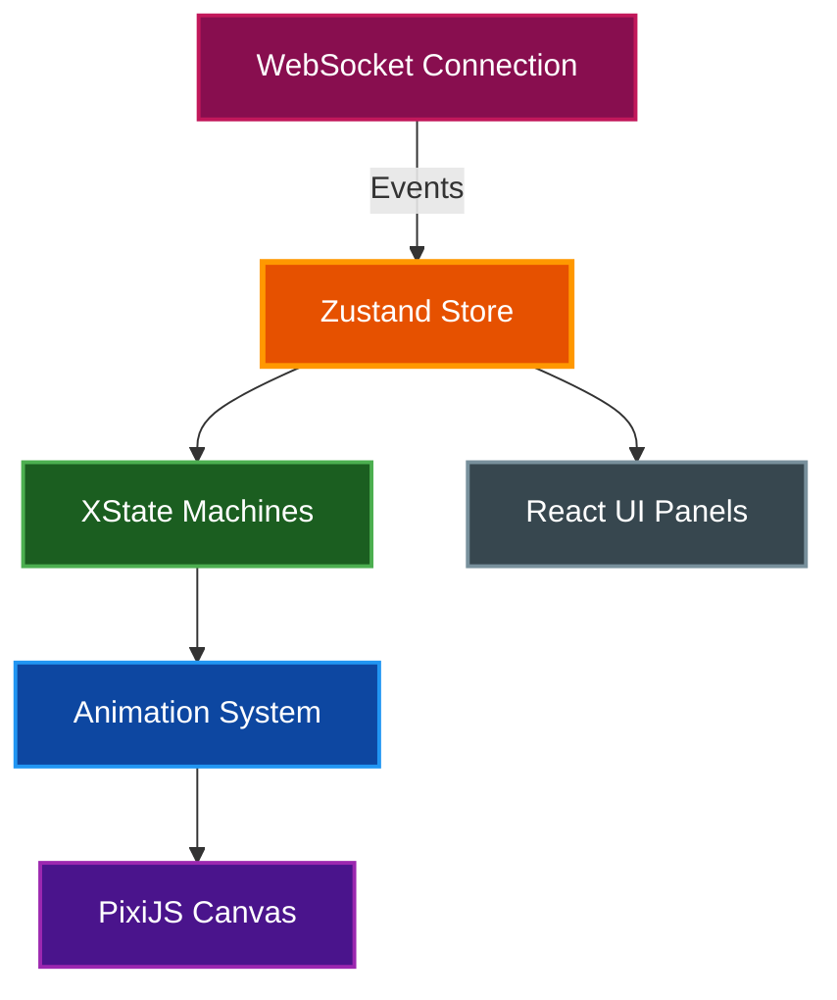

# Claude Office Visualizer Frontend

Next.js application that renders a real-time pixel art office simulation using PixiJS, visualizing Claude Code operations as animated office activities.

## Table of Contents

- [Overview](#overview)
- [Architecture](#architecture)
- [Prerequisites](#prerequisites)
- [Installation](#installation)
- [Running the Application](#running-the-application)
- [Project Structure](#project-structure)
- [Key Components](#key-components)
- [State Management](#state-management)
- [Debug Tools](#debug-tools)
- [Testing](#testing)
- [Related Documentation](#related-documentation)

## Overview

The frontend provides an interactive visualization of Claude Code operations:

- **Real-time Rendering**: PixiJS-powered 2D canvas at 1280x1024 native resolution
- **Character Animation**: Boss and agent sprites with walk, idle, and typing animations
- **State Machines**: XState v5 manages agent lifecycle with explicit states and transitions
- **WebSocket Updates**: Live state synchronization with the backend
- **Session Browser**: Collapsible sidebar for session history and replay
- **Debug Tools**: Keyboard shortcuts for path visualization, queue slots, and time controls

## Architecture



### Data Flow

1. WebSocket receives state updates from backend
2. Zustand store updates with new state (agents, boss, context)
3. XState machines process agent lifecycle transitions
4. Animation system interpolates positions and timing
5. PixiJS canvas renders the current frame
6. React UI panels display session info, event log, git status

## Prerequisites

| Requirement    | Version    | Purpose              |
| -------------- | ---------- | -------------------- |
| Node.js or Bun | 20+ / 1.0+ | Runtime              |
| Backend server | Running    | WebSocket connection |

## Installation

```bash
# From the frontend directory
bun install
```

Or with npm:

```bash
npm install
```

## Running the Application

### Development Mode

```bash
# From the frontend directory
make dev
```

Or directly:

```bash
bun run dev
```

The application runs at [http://localhost:3000](http://localhost:3000).

> **📝 Note:** The backend must be running at `localhost:8000` for WebSocket connectivity.

### Production Build

```bash
# Build for production
bun run build

# Start production server
bun run start
```

### Static Export

For deployment with the backend:

```bash
# From project root
make build-static
```

This exports the frontend and copies it to `backend/static/` for FastAPI serving.

## Project Structure

```
frontend/src/
├── app/                          # Next.js App Router
│   ├── page.tsx                  # Main application route
│   ├── layout.tsx                # Root layout
│   └── sprite-debug/             # Sprite sheet building tool
├── components/
│   ├── game/                     # Game components
│   │   ├── OfficeGame.tsx        # Main canvas component
│   │   ├── OfficeBackground.tsx  # Floor and wall rendering
│   │   ├── AgentSprite.tsx       # Agent character rendering
│   │   ├── BossSprite.tsx        # Boss character with movement
│   │   ├── TrashCanSprite.tsx    # Context utilization display
│   │   ├── CityWindow.tsx        # Day/night city skyline
│   │   ├── EmployeeOfTheMonth.tsx # Wall poster decoration
│   │   ├── Whiteboard.tsx        # Todo list display
│   │   ├── WallClock.tsx         # Animated wall clock
│   │   ├── SafetySign.tsx        # Tool counter display
│   │   ├── MarqueeText.tsx       # Scrolling text component
│   │   ├── DeskMarquee.tsx       # Task display above desks
│   │   ├── DeskGrid.tsx          # Desk layout management
│   │   ├── Elevator.tsx          # Elevator animation
│   │   ├── PrinterStation.tsx    # Printer animation
│   │   ├── LoadingScreen.tsx     # Loading screen with quotes
│   │   ├── DebugOverlays.tsx     # Debug visualization tools
│   │   ├── ZoomControls.tsx      # Zoom level controls
│   │   ├── EventLog.tsx          # Event log panel
│   │   ├── GitStatusPanel.tsx    # Git status display
│   │   └── AgentStatus.tsx       # Agent status indicator
│   └── overlay/                  # Modal components
│       └── Modal.tsx             # Modal overlay component
├── stores/
│   └── gameStore.ts              # Unified Zustand store
├── machines/
│   ├── agentMachine.ts           # XState agent lifecycle
│   └── agentMachineService.ts    # Machine spawning/routing
├── systems/
│   ├── animationSystem.ts        # Single RAF loop
│   ├── compactionAnimation.ts    # Boss stomp animation
│   ├── pathfinding.ts            # Pathfinding orchestration
│   ├── astar.ts                  # A* algorithm implementation
│   ├── pathSmoothing.ts          # Path optimization
│   ├── navigationGrid.ts         # Collision grid
│   ├── queuePositions.ts         # Queue slot coordinates
│   ├── agentCollision.ts         # Agent overlap prevention
│   └── hmrCleanup.ts             # Hot module reload cleanup
├── hooks/
│   ├── useWebSocketEvents.ts     # WebSocket message handler
│   └── useOfficeTextures.ts      # Texture loading hook
├── constants/
│   ├── canvas.ts                 # Canvas dimensions
│   ├── positions.ts              # Coordinate constants
│   └── quotes.ts                 # Loading screen quotes
└── types/
    └── index.ts                  # TypeScript type definitions
```

## Key Components

### OfficeGameV2

The main canvas component that orchestrates all rendering:

- Floor, walls, and furniture drawing
- Character sprite management
- Speech bubble display
- Debug overlay rendering

### Agent State Machine

Agents follow a defined lifecycle through XState:

```
Arrival:  spawn → arriving → in_queue → walking_to_ready → conversing
          → walking_to_boss → at_boss → walking_to_desk → idle

Departure: idle → departing → in_queue → walking_to_ready → conversing
           → walking_to_boss → at_boss → walking_to_elevator → removed
```

### Animation System

Single `requestAnimationFrame` loop manages:

- Position interpolation (200 pixels/second)
- Bubble timers (3 second minimum display)
- Queue advancement checks
- Path recalculation on collision

## State Management

### Zustand Store

The unified store (`stores/gameStore.ts`) contains:

| Category | State                                                           |
| -------- | --------------------------------------------------------------- |
| Agents   | `agents`, `arrivalQueue`, `departureQueue`                      |
| Boss     | `boss`, `compactionPhase`                                       |
| Office   | `sessionId`, `deskCount`, `elevatorState`, `todos`              |
| Context  | `contextUtilization`, `isCompacting`, `toolUsesSinceCompaction` |
| UI       | `isConnected`, `isReplaying`, `debugMode`                       |

### Selectors

Use primitive selectors to prevent unnecessary re-renders:

```typescript
const contextUtilization = useGameStore(selectContextUtilization);
const isCompacting = useGameStore(selectIsCompacting);
```

## Debug Tools

Press `D` to toggle debug mode, then use additional shortcuts:

| Key | Action                                            |
| --- | ------------------------------------------------- |
| `D` | Toggle debug mode                                 |
| `P` | Show agent paths (waypoints as colored lines)     |
| `Q` | Show queue slot positions                         |
| `L` | Show phase labels above agents                    |
| `O` | Show obstacle grid                                |
| `T` | Fast-forward city time (24h cycle in ~12 seconds) |

Debug preferences persist to `localStorage`.

## Testing

```bash
# Run type checking
make typecheck

# Run linting
make lint

# Run all checks
make checkall
```

### Code Quality

```bash
# Format code
make fmt

# Lint with auto-fix
bun run lint --fix
```

## Related Documentation

- [Project README](../README.md) - Project overview
- [Architecture](../docs/ARCHITECTURE.md) - System design details
- [Quick Start](../docs/QUICKSTART.md) - Getting started guide
- [PRD](../PRD.md) - Full product requirements
