# Claude Office Hooks

Python package that integrates Claude Code lifecycle events with the Claude Office Visualizer backend, forwarding events via HTTP to enable real-time office visualization.

## Table of Contents

- [Overview](#overview)
- [Architecture](#architecture)
- [Prerequisites](#prerequisites)
- [Installation](#installation)
- [Configuration](#configuration)
- [Supported Events](#supported-events)
- [Debugging](#debugging)
- [Troubleshooting](#troubleshooting)
- [Related Documentation](#related-documentation)

## Overview

The hooks package bridges Claude Code and the visualizer:

- **Event Capture**: Intercepts Claude Code lifecycle events (tool use, prompts, sessions)
- **Event Mapping**: Transforms raw hook data into backend-compatible event payloads
- **Silent Operation**: Never outputs to stdout/stderr to avoid disrupting Claude
- **Fail-Safe**: Always exits with code 0 to prevent blocking Claude actions

## Architecture

```mermaid
graph LR
    CC[Claude Code]
    Hook[claude-office-hook]
    API[Backend API]
    WS[WebSocket]
    FE[Frontend]

    CC -->|Lifecycle Events| Hook
    Hook -->|HTTP POST| API
    API -->|Broadcast| WS
    WS --> FE

    style CC fill:#4a148c,stroke:#9c27b0,stroke-width:2px,color:#ffffff
    style Hook fill:#e65100,stroke:#ff9800,stroke-width:3px,color:#ffffff
    style API fill:#1b5e20,stroke:#4caf50,stroke-width:2px,color:#ffffff
    style WS fill:#880e4f,stroke:#c2185b,stroke-width:2px,color:#ffffff
    style FE fill:#0d47a1,stroke:#2196f3,stroke-width:2px,color:#ffffff
```



### Event Flow

1. Claude Code triggers a lifecycle hook (e.g., `PreToolUse`)
2. Hook receives JSON data via stdin
3. `claude-office-hook` maps the event to backend format
4. Event is POSTed to `http://localhost:8000/api/v1/events`
5. Backend broadcasts to connected frontend clients

## Prerequisites

| Requirement | Version | Purpose |
|-------------|---------|---------|
| Python | 3.14+ | Runtime |
| uv | Latest | Package management |
| Claude Code | Latest | Event source |

## Installation

### Quick Install

From the project root:

```bash
make hooks-install
```

Or from the hooks directory:

```bash
./install.sh
```

### Manual Installation

```bash
cd hooks
uv tool install -p 3.14 .
```

### Verify Installation

```bash
# Check hooks are installed
make hooks-status

# Expected output:
# Hooks installed: yes
# Config file: ~/.claude/settings.json
# Hook path: /path/to/claude-office/hooks
```

> **⚠️ Warning:** After installing hooks, restart Claude Code for changes to take effect.

## Configuration

Configuration is stored in `~/.claude/claude-office-config.env`:

```bash
# Prefixes to strip from project names in the session browser
CLAUDE_OFFICE_STRIP_PREFIXES="-Users-probello-Repos-,-Users-probello-"

# Set to 1 to enable debug logging
CLAUDE_OFFICE_DEBUG=0
```

### Strip Prefixes

Project names are derived from Claude's transcript path. By default, common path prefixes are stripped for cleaner display:

| Raw Project Name | After Stripping |
|------------------|-----------------|
| `-Users-probello-Repos-my-project` | `my-project` |
| `-Users-probello-my-project` | `my-project` |

Customize prefixes during installation:

```bash
./install.sh --strip-prefixes '-Users-myname-Projects-,-Users-myname-'
```

Or edit the config file and restart Claude Code.

## Supported Events

| Claude Hook | Mapped Event Type | Purpose |
|-------------|-------------------|---------|
| `SessionStart` | `session_start` | Initialize office, boss arrives |
| `SessionEnd` | `session_end` | Cleanup, boss leaves |
| `PreToolUse` | `pre_tool_use` | Show working state |
| `PreToolUse` (Task) | `subagent_start` | Spawn employee agent |
| `PostToolUse` | `post_tool_use` | Clear working state |
| `PostToolUse` (Task) | `subagent_stop` | Employee completes work |
| `UserPromptSubmit` | `user_prompt_submit` | Phone rings, boss receives |
| `PermissionRequest` | `permission_request` | Show waiting state |
| `Notification` | `notification` | Display notification |
| `Stop` | `stop` | Boss completing |
| `PreCompact` | `context_compaction` | Trigger compaction animation |
| `SubagentStart` | `subagent_info` | Update agent with native ID |

### Event Data Mapping

The hook extracts and maps key fields:

| Source Field | Mapped Field | Description |
|--------------|--------------|-------------|
| `session_id` | `session_id` | Claude session identifier |
| `transcript_path` | `transcript_path` | Path to JSONL transcript |
| `tool_name` | `tool_name` | Tool being used |
| `tool_input` | `tool_input` | Tool parameters |
| `tool_use_id` | `tool_use_id` | Unique tool invocation ID |
| `CLAUDE_PROJECT_DIR` | `project_dir` | Stable project root |
| `agent_id` | `native_agent_id` | Claude's internal agent ID |
| (derived) | `agent_transcript_path` | Path to subagent transcript |

## Debugging

### Enable Debug Logging

Edit `~/.claude/claude-office-config.env`:

```bash
CLAUDE_OFFICE_DEBUG=1
```

### View Debug Logs

```bash
# From project root
make hooks-logs

# Or follow logs in real-time
make hooks-logs-follow

# Or directly
tail -f ~/.claude/claude-office-hooks.log
```

### Log Format

Debug logs show both raw input and mapped output:

```
============================================================
[2026-01-20T15:30:45.123456+00:00] Event: pre_tool_use
--- RAW INPUT FROM CLAUDE CODE ---
{
  "session_id": "abc123",
  "tool_name": "Bash",
  "tool_input": {"command": "ls -la"},
  "tool_use_id": "toolu_01ABC..."
}
--- MAPPED PAYLOAD TO BACKEND ---
{
  "event_type": "pre_tool_use",
  "session_id": "abc123",
  "timestamp": "2026-01-20T15:30:45.123456+00:00",
  "data": {
    "tool_name": "Bash",
    "tool_input": {"command": "ls -la"},
    "tool_use_id": "toolu_01ABC...",
    "agent_id": "main"
  }
}
============================================================
```

## Troubleshooting

### Hooks Not Triggering

1. **Verify installation:**
   ```bash
   make hooks-status
   ```

2. **Check Claude Code settings:**
   ```bash
   cat ~/.claude/settings.json | grep hooks
   ```

3. **Enable debug logging and check logs:**
   ```bash
   make hooks-debug-on
   make hooks-logs-follow
   ```

4. **Restart Claude Code** after any changes

### Backend Not Receiving Events

1. **Verify backend is running:**
   ```bash
   curl http://localhost:8000/health
   ```

2. **Check hook logs for connection errors:**
   ```bash
   grep -i error ~/.claude/claude-office-hooks.log
   ```

### Events Showing Wrong Project Name

Edit strip prefixes in `~/.claude/claude-office-config.env`:

```bash
CLAUDE_OFFICE_STRIP_PREFIXES="-Users-yourname-YourFolder-"
```

Then restart Claude Code.

## Uninstallation

```bash
# From project root
make hooks-uninstall

# Or from hooks directory
./uninstall.sh
```

This removes hooks from Claude Code settings but preserves the config file.

## Related Documentation

- [Project README](../README.md) - Project overview
- [Quick Start](../docs/QUICKSTART.md) - Getting started guide
- [Architecture](../docs/ARCHITECTURE.md) - System design details
- [PRD Section 7](../PRD.md#7-claude-code-hook-integration) - Hook integration details
