# Claude Office Scripts

Utility scripts for testing and demonstrating the Claude Office Visualizer without requiring live Claude Code sessions.

## Table of Contents

- [Overview](#overview)
- [Prerequisites](#prerequisites)
- [Available Scripts](#available-scripts)
- [Simulation Script](#simulation-script)
- [Single Agent Test](#single-agent-test)
- [Running Scripts](#running-scripts)
- [Related Documentation](#related-documentation)

## Overview

The scripts directory contains testing utilities that simulate Claude Code events:

- **Event Simulation**: Send realistic event sequences to exercise frontend features
- **Background Tasks**: Simulate background task notifications for the Remote Workers display
- **Pathfinding Debug**: Test agent navigation with single-agent scenarios
- **Demo Mode**: Showcase the visualizer without active Claude Code sessions

## Prerequisites

| Requirement | Version | Purpose |
|-------------|---------|---------|
| Python | 3.14+ | Runtime |
| uv | Latest | Package management |
| Backend | Running | Event receiver at `localhost:8000` |
| Frontend | Running | Visualization at `localhost:3000` |

## Available Scripts

| Script | Purpose | Session ID |
|--------|---------|------------|
| `simulate_events.py` | Full simulation with multiple agents | `sim_session_123` |
| `test_single_agent.py` | Debug pathfinding with one agent | `test_single_agent` |

## Simulation Script

The main simulation script exercises all frontend features in a coordinated sequence.

### Features Tested

```mermaid
graph TD
    Session[Session Lifecycle]
    Agents[Agent Management]
    Context[Context Window]
    UI[UI Elements]

    Session --> Start[Session Start]
    Session --> End[Session End]

    Agents --> Spawn[Agent Spawning]
    Agents --> Work[Tool Use]
    Agents --> Depart[Agent Departure]

    Context --> Fill[Token Accumulation]
    Context --> Compact[Compaction at 80%]

    UI --> Todos[Whiteboard Todos]
    UI --> Remote[Remote Workers]
    UI --> Marquee[Desk Marquees]
    UI --> Bubbles[Speech Bubbles]

    style Session fill:#e65100,stroke:#ff9800,stroke-width:3px,color:#ffffff
    style Agents fill:#1b5e20,stroke:#4caf50,stroke-width:2px,color:#ffffff
    style Context fill:#0d47a1,stroke:#2196f3,stroke-width:2px,color:#ffffff
    style UI fill:#4a148c,stroke:#9c27b0,stroke-width:2px,color:#ffffff
    style Start fill:#37474f,stroke:#78909c,stroke-width:2px,color:#ffffff
    style End fill:#37474f,stroke:#78909c,stroke-width:2px,color:#ffffff
    style Spawn fill:#37474f,stroke:#78909c,stroke-width:2px,color:#ffffff
    style Work fill:#37474f,stroke:#78909c,stroke-width:2px,color:#ffffff
    style Depart fill:#37474f,stroke:#78909c,stroke-width:2px,color:#ffffff
    style Fill fill:#37474f,stroke:#78909c,stroke-width:2px,color:#ffffff
    style Compact fill:#37474f,stroke:#78909c,stroke-width:2px,color:#ffffff
    style Todos fill:#37474f,stroke:#78909c,stroke-width:2px,color:#ffffff
    style Marquee fill:#37474f,stroke:#78909c,stroke-width:2px,color:#ffffff
    style Bubbles fill:#37474f,stroke:#78909c,stroke-width:2px,color:#ffffff
    style Remote fill:#37474f,stroke:#78909c,stroke-width:2px,color:#ffffff
```



### Simulation Sequence

1. **Session Start** - Initialize office, boss arrives
2. **Todo Creation** - Add items to whiteboard
3. **Agent Spawning** - Employees arrive from elevator with creative names
4. **Tool Use** - Agents work at desks, showing tool bubbles
5. **Context Building** - Token usage increases toward 80%
6. **Compaction** - Boss walks to trash can, stomps 5 times
7. **Agent Departure** - Employees return to elevator
8. **Background Tasks** - Simulate 4 background task completions (3 success, 1 failure)
9. **Session End** - Cleanup

### Agent Names

The simulation uses creative job titles:

| Name | Name | Name |
|------|------|------|
| Scout | Fixer | Builder |
| Tester | Validator | Researcher |
| Debugger | Optimizer | Refactorer |
| Doc Writer | Type Ninja | Bug Hunter |
| Code Sage | Test Wizard | Lint Master |

### Context Window Behavior

| Parameter | Value | Description |
|-----------|-------|-------------|
| Max tokens | 200,000 | Simulated context limit |
| Start percentage | 20% | Initial context usage |
| Compaction threshold | 80% | Triggers boss animation |
| Post-compaction | ~30% | Reduced after stomping |

### Background Task Notifications

The simulation sends 4 background task notifications to populate the Remote Workers whiteboard mode:

| Task ID | Status | Summary |
|---------|--------|---------|
| `bg_task_a1b2c3d4` | completed | Linting codebase with ruff |
| `bg_task_e5f6g7h8` | completed | Running type checks with pyright |
| `bg_task_i9j0k1l2` | failed | Deploy to production failed |
| `bg_task_m3n4o5p6` | completed | Generated API documentation |

View these in the whiteboard by pressing `1` or `B` to switch to Remote Workers mode.

## Single Agent Test

A minimal script for debugging pathfinding and agent lifecycle.

### Test Sequence

```
Step 1: Session start
Step 2: Spawn agent at elevator (56, 190)
Step 3: Agent walks to boss slot (520, 868)
Step 4: Agent walks to desk 1 (256, 464) and works
Step 5: Agent completes work
Step 6: Agent walks to departure queue (760, 868) then elevator (86, 192)
Step 7: Session end
```

### Path Verification

The script prints expected positions to verify pathfinding:

```
Agent should spawn in elevator zone (first position: 56, 190)
Agent will queue for boss slot at (520, 868)
Path: boss slot -> corridor -> desk 1 (256, 464)
Path: desk -> corridor -> boss right slot (760, 868) -> elevator (86, 192)
```

## Running Scripts

### From Project Root

```bash
# Run full simulation (also available via frontend Simulate button)
make simulate

# Run single agent test
make test-agent
```

### From Scripts Directory

```bash
cd scripts

# Full simulation
uv run python simulate_events.py

# Single agent test
uv run python test_single_agent.py
```

### Via Backend API

The simulation can also be triggered via API:

```bash
curl -X POST http://localhost:8000/api/v1/sessions/simulate
```

Or click the **Simulate** button in the frontend header.

## Configuration

### Simulation Constants

Edit `simulate_events.py` to adjust behavior:

| Constant | Default | Description |
|----------|---------|-------------|
| `API_URL` | `http://localhost:8000/api/v1/events` | Backend endpoint |
| `SESSION_ID` | `sim_session_123` | Session identifier |
| `MAX_CONTEXT_TOKENS` | `200000` | Simulated context limit |
| `COMPACTION_THRESHOLD` | `0.80` | Trigger at 80% |
| `COMPACTION_ANIMATION_DURATION` | `10` | Seconds for animation |

### Adding Custom Agents

Add names to the `AGENT_NAMES` list:

```python
AGENT_NAMES = [
    "Scout",
    "Fixer",
    # Add your custom names here
    "My Custom Agent",
]
```

### Adding Task Descriptions

Add descriptions to the `TASK_DESCRIPTIONS` list:

```python
TASK_DESCRIPTIONS = [
    "Analyze authentication flow...",
    # Add your custom tasks here
    "My custom task description for the marquee",
]
```

## Related Documentation

- [Project README](../README.md) - Project overview
- [Quick Start](../docs/QUICKSTART.md) - Getting started guide
- [Backend README](../backend/README.md) - Backend API details
- [Frontend README](../frontend/README.md) - Frontend visualization
